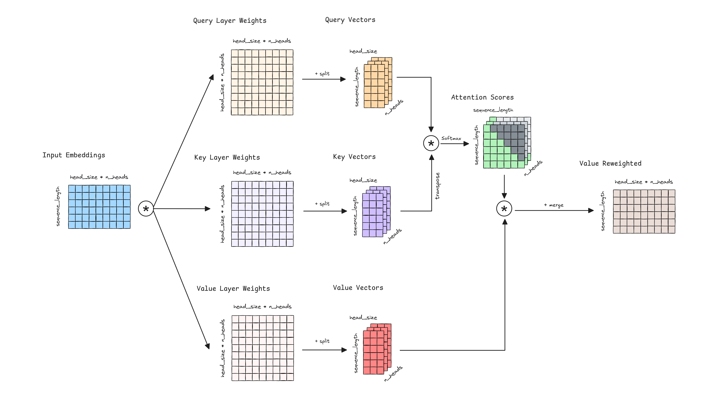
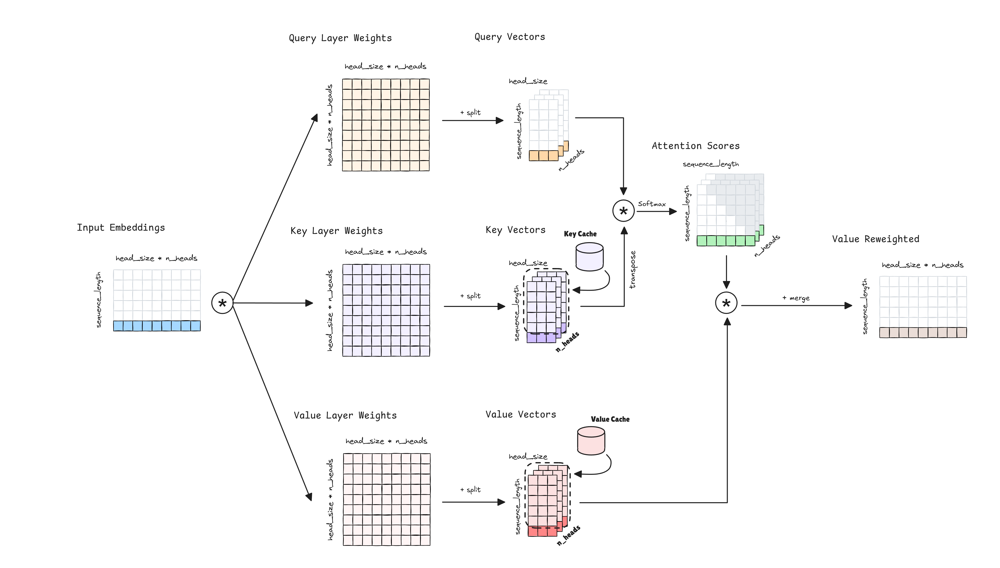
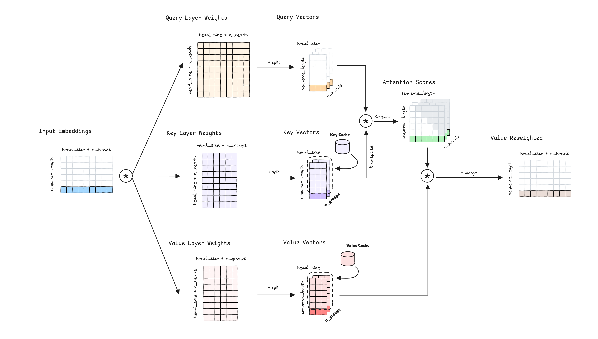

import Highlight from '../../components/Highlight.astro';

This post delves into the fascinating world of attention layers,
exploring their evolution from the base multi-head attention to more recent variants
like multi-query and grouped-query attention.
We'll examine why these newer architectures appeared
and how they address the limitations of their predecessors.

As advance, the <Highlight color="yellow">inference complexities</Highlight>, spatial and temporal,
are the core of the improvements, focusing on how to <Highlight color="yellow">reduce the cache</Highlight> needed
without losing the performance of the model.

## Multi-Head Attention

Let's recall the Attention mechanism, the cornerstone of the [Transformer architecture](/blog/transformer).
The input sequence is projected into three different spaces: query, key, and value.
Attention scores are computed by taking the dot product of the query and key vectors, then scaled, masked and softmaxed
to obtain the attention weights. 
Finally, the output is the weighted dot product of the attention weights and the value vectors.
The idea of the Attention mechanism is to model the relationships between the tokens in the input sequence.

The Multi-Head Attention extends this idea by computing multiple attention heads in parallel,
splitting the query, key, and value vectors into $n_{heads}$ different heads.
If you notice, in a simple attention mechanism, when calculating the product between
the attention weights and the value matrix, we are modeling relationships between tokens based
on a single set of attention patterns. However, in Multi-Head Attention,
we create multiple sets of queries, keys, and values through linear projections of the input.
This allows us to apply the <Highlight color="yellow">attention mechanism separately for each *head*</Highlight>,
enabling the model to 
<Highlight color="green">capture different aspects of the relationships between tokens simultaneously</Highlight>.
Each head can focus on different features or patterns in the data,
providing multiple perspectives on the input.
The outputs from all heads are then combined,
allowing the model to integrate information from these various viewpoints.
This approach enhances the model's ability to capture complex,
multi-faceted relationships within the data.

Next is the Multi-Head Attention mechanism. The $head\_size*n\_heads$ is usually named as the model dimension, hidden size,
or embedding size. The $head\_size$ is the size of the hidden layer in each head, and $n\_heads$ is the number of heads.

### KV-Cache

Transformer models are huge and different optimization techniques appeared to speed up the inference.
The objective of our model inference is to produce the next token that follows the last token in the intput sequence (next token prediction).
What do we need to compute this? Just the <Highlight color="brown">final embedding of the last token</Highlight>, the last token representation of the Value Reweighted.

To obtain this embedding, last token representation of the Value Reweighted,
we need to compute the dot product between the Attention Scores and the Value Vectors.

The Value Layer Weights are allways the same, as we are at inference, then Value Vectors for the tokens 
previous to the last token are the same and we just need to compute the new last one.
We can <Highlight color="red">**cache Value Vectors from previous tokens and reuse them**</Highlight>.

Regarding the <Highlight color="green">Attention Scores</Highlight>, for obtaining the last token representation of the Value Reweighted we just need
the Attention Scores of the last token. For calculating this final attention row, we just need the <Highlight color="orange">Query Vectors of the last token</Highlight> and make the dot product with all the Key Vectors. But the Key Vectors from previous tokens 
are the same than when were computed in the previous step,
then we can <Highlight color="purple">**cache Key Vectors from pevious tokens and reuse them**</Highlight>.

And with this last token embedding and the Key and Value vectors cached,
we can iterate over the Transformer blocks and compute the final embedding of the last token representation.

**¿Why don't we cache the Query Vectors?** Because we don't need all the Query Vectors, just the last one.
For calculating the last token Value Reweighted we just need the Attention Scores of the last token,
and for that one we just need the last Query Vector.

Caching the Key and Value Vectors, we can save computations and **speed up the inference process**. The cost of
caching those vectors is **$l \times b \times n \times h \times s \times 2 \times 2$**, where the final terms $2 \times 2$
correspond to the number of caches per layer (one for Key and one for Value), and the number of bytes per floating
point value (assuming each model parameter is a 16-bit floating point value), respectively. The rest of the terms are:

| Hyperparameter | Description |
| :--- | :--- |
| $l$ | Number of Transformer layers in the model. |
| $b$ | Batch size. |
| $n$ | Number of attention heads. |
| $h$ | Head hidden size. |
| $s$ | Sequence length. |

Can we further reduce the cache needed? Yes, we can! By reducing the size of the cache,
improving the load and therefore the speed of inference and also the memory required.
That is, at the cost of some of the performance of our model.

## Multi-Query Attention

If we look closer at the Multi-Head Attention mechanism, we can see that the Key and Value Vectors 
have different set of weights for each head. How can we reduce the cache needed for the Key and Value Vectors?
Simple, we can **reduce the number of Key and Value heads needed**. Particularly, Multi-Query Attention
proposes to **use a single set of Key and Value Vectors**.
This obviously will reduce the capacity of the model to capture different aspects of the relationships between tokens,
we have less heads to model the relationships,
and therefore the performance of the model will be affected. But, it will reduce the cache needed and the inference time.

The cost of caching the Key and Value Vectors is **$l \times b \times h \times s \times 2 \times 2$**.
Note how the number of attention heads $n$ is not present in the formula.

### Inefficient Parallelization

Many large Transformer models require more memory than can fit on a single GPU, employing model 
parallelism to distribute the model across multiple GPUs. This is accomplished usually with Tensor Parallelism,
**assigning different attention heads to different GPUs**.

For example, 175B GPT-3 model has 96 attention heads, and if we have 8 GPUs, we can assign 12 heads to each GPU.

Each GPU performs the entire attention computation for its assigned heads, then all GPUs exchange the results
of their computations. With Multi-Query Attention, **each attention head has the same set of Key and Value Vectors**,
computing and caching the same set of Key and Value Vectors in each GPU. This is **inefficient**, as we are computing
the same values in each GPU at the same time we are reducing the capacity of the model.

## Grouped-Query Attention

Grouped-Query Attention tries to solve the inefficient parallelization of Multi-Query Attention.
To do so, it proposes to increase the number of Key and Value Vectors heads to an arbitrary number,
an hyperparameter $G$. The Query Vectors are grouped in $G$ groups,
and each group has a different set of Key and Value Vectors.

When operating in a **multi-GPU environment** with tensor parallelism, we can essentially get the **same speed up as
Multi-Query Attention** by setting **$G$ equal to the number of GPUs**, but with the advantage of providing the model
with more capacity and performance. The cost of caching the Key and Value Vectors is **$l \times b \times G \times h \times s \times 2 \times 2$**.
Note how the number of attention heads $n$ is not present in the formula, being replaced by the hyperparameter $G$.

## Speed ups references

To put in context the speed ups of the different attention mechanisms, we can see the following table:

| Model | Parameter Count | KV Cache Size MHA | KV Cache Size MQA | KV Cache Size MGA |
| :--- | :--- | :--- | :--- | :--- |
| GPT-3 | 175B | 4.5GB | 48MB | 384MB |

## Credits

- [Multi-Query & Grouped-Query Attention - Tinkerd](https://tinkerd.net/blog/machine-learning/multi-query-attention/)
- [Speeding up the GPT - KV cache](https://dipkumar.dev/becoming-the-unbeatable/posts/gpt-kvcache/)
- <a href="/diagrams/attention_layers.excalidraw" download="attention_layers.excalidraw">Attention Layers Excalidraw diagram source</a> 