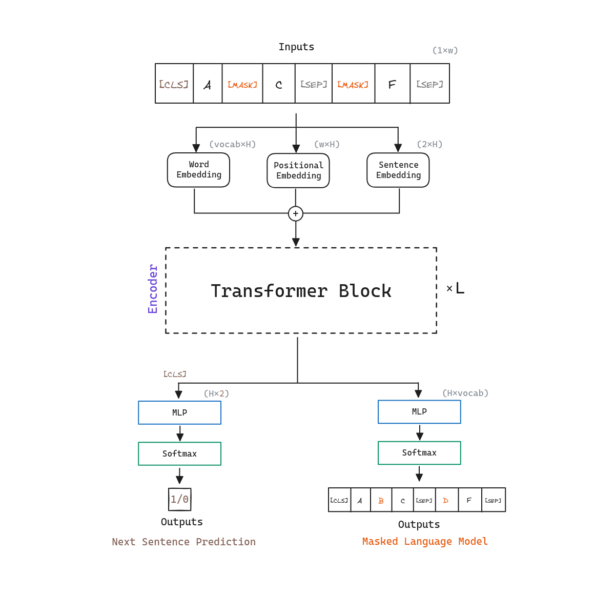

## Abstract

Left-to-right architectures may be sub-optimal for <mark style="background: #FFB8EBA6;">sentence-level tasks</mark> such as sentence classification, and very harmful for token-level tasks such as question answering or named entity recognition. <mark style="background: #BBFABBA6;">There are tasks where incorporating context from left and right of a token is crucial</mark>.

BERT, which stands for Bidirectional Encoder Representations from Transformers, aims to alleviate the problem of unidirectionality by using a <mark style="background: #FFF3A3A6;">masked language model</mark> (MLM) pre-training objective, inspired by the Cloze task. In addition, authors also use a <mark style="background: #FFF3A3A6;">next sentence prediction</mark> task that jointly pretrains text-pair representations.

There are two steps in BERT framework: **<mark style="background: #ADCCFFA6;">pre-training</mark>** and **<mark style="background: #ADCCFFA6;">fine-tuning</mark>**. BERT aims to first understand the language, and then use that understanding to perform a task. This way, the model can be fine-tuned to perform a wide variety of tasks with minimal additional training.

## Architecture

BERT's model architecture is a multi-layer **<mark style="background: #ABF7F7A6;">bidirectional Transformer Encoder</mark>**, almost identical to the original [[Transformer - Attention Is All You Need]] implementation.

BERT denotes the number of the Transformer encoder blocks as $L$, the hidden size as $H$, and the number of self-attention heads as $A$. BERT initial model designs are the following:

| Model Name      | $L$ (Transformer blocks) | $H$ (Hidden size) | $A$ (Self-Attention heads) |
|------------------|---------------------------|--------------------|----------------------------|
| $BERT_{BASE}$   | 12                        | 768                | 12                         |
| $BERT_{LARGE}$  | 24                        | 1024               | 16                         |
## Pre-training

The objective of pre-training is to **learn a general-purpose language representation** that can be used for downstream tasks. BERT focuses on two unsupervised tasks:
- Learning from the <mark style="background: #FFF3A3A6;">surrounding context</mark>, through a masked language model.
- Learning from the <mark style="background: #FFF3A3A6;">relationship between two sentences</mark>, through a next sentence prediction task (helpful for some downstream tasks such as question answering).

<mark style="background: #BBFABBA6;">Both tasks are trained at the same time, summing their losses</mark>. For the pre-training corpus, BERT uses the BooksCorpus (800M words) and English Wikipedia (2,500M words). Note that it is critical to use a document-level corpus rather than a shuffled sentence-level corpus, so <mark style="background: #FFF3A3A6;">long contiguous sequences</mark> can be used.

### Masked Language Model

The bidirectional context understanding can enable to capture intricate dependencies and relationships among words, resulting in more robust and contextually rich representations.

Previous methods suffered from the unidirectionality constraint: a word can only attend to previous words in the self-attention layers. In order to train deep bidirectional representations, <mark style="background: #FFB86CA6;">BERT simply masks some percentage of the input tokens at random</mark>, and then predicts those masked tokens. This is different from traditional language modeling, where the model is trained to predict the next word in a sequence where only the previous words are visible. BERT authors refer to this procedure as a <mark style="background: #FFF3A3A6;">masked language model</mark> (MLM).

The procedure is as follows:
1. Tokenize the input sequence.
2. Replace 15% tokens with:
	- 80% of the time: **`[MASK]`** token.
	- 10% of the time: a random token.
	- 10% of the time: the original token.
3. Feed the sequence to the model.
4. Only for the replaced tokens, compute cross entropy loss between the output and the original sequence.

Although MLM allows BERT to obtain a bidirectional pre-trained model, a downside is that it creates a mismatch between pre-training and fine-tuning, since the `[MASK]` token does not appear during fine-tuning. That's why BERT sometimes replaces the masked tokens with the original and random tokens.

### Next Sentence Prediction

Some downstream tasks such as Question Answering (QA) and Natural Language Inference (NLI) are based on understanding the *relationship* between sentences. 

In order to train a model that understands sentence relationships, BERT authors pre-train the model with a simple task called <mark style="background: #FFF3A3A6;">next sentence prediction</mark>. For next sentence prediction two sentences are chosen at random, and the model is trained to predict whether the second sentence is the actual next sentence in the original document. The model is trained with 50% of the time the second sentence is the <mark style="background:rgba(216, 192, 175, 0.85);">actual next sentence</mark>, and 50% of the time it is a <mark style="background:rgba(216, 192, 175, 0.85);">random sentence</mark> from the corpus.

BERT adds a special token called <mark style="background:rgba(216, 192, 175, 0.85);">[SEP] between the two sentences </mark>and a **`[CLS]`** token at the beginning of the first sentence. The final hidden state of this <mark style="background:rgba(216, 192, 175, 0.85);">[CLS] token is used for next sentence prediction</mark>. In addition, BERT <mark style="background:rgba(216, 192, 175, 0.85);">adds learned embeddings to every token indicating whether it belongs to the first or second sentence</mark>.

## Fine-tuning

Swapping out the appropriate inputs and outputs, BERT can be used for a <mark style="background: #FFB8EBA6;">wide variety of downstream tasks, whether they involve single text or text pairs</mark>. To do so, BERT fine-tunes all the parameters end-to-end. Compared to pre-training, fine-tuning is relatively inexpensive.

At the output, the <mark style="background: #FFF3A3A6;">token representations</mark> are fed into an output layer for token-level tasks such as named entity recognition, and the `[CLS]` representation is fed into an output layer for classification tasks such as entailment or sentiment analysis.

## References

- [Paper - BERT: Pre-training of Deep Bidirectional Transformers for Language Understanding](https://arxiv.org/abs/1810.04805)
- [BERT Official Repository - Tensorflow](https://github.com/google-research/bert)
- [BERT Pytorch Implementation](https://github.com/codertimo/BERT-pytorch/tree/master)
- <a href="/diagrams/bert.excalidraw" download="bert.excalidraw">BERT Excalidraw diagram source</a>
