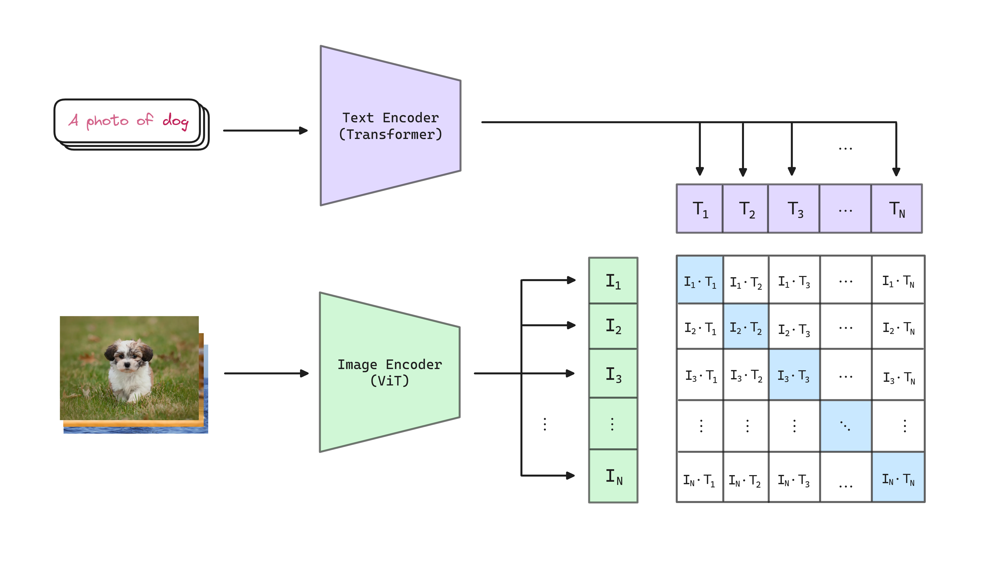
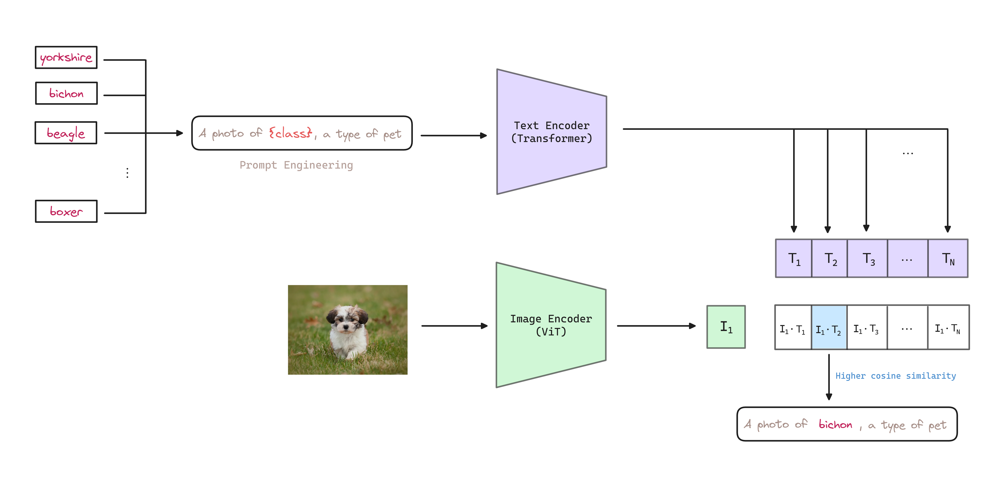

## Abstract
  
Generally, computer vision systems are trained to predict a fixed set of predetermined object categories. This restricted form of supervision limits their generality and usability since additional labeled data is needed to specify any other visual concept. Natural language is able to express, and therefore supervise, a much wider set of visual concepts trough its generality.

CLIP proposes <mark style="background: #ABF7F7A6;">learning directly from raw text about images</mark>. To do so authors use the simple pre-training task of <mark style="background: #BBFABBA6;">predicting which caption goes with which image</mark> encouraging the model to learn a <mark style="background: #FFF3A3A6;">joint representation of images and text</mark>.

After pre-training, natural language is used to reference learned visual concepts (or describe new ones) enabling <mark style="background: #D2B3FFA6;">zero-shot transfer</mark> of the model to downstream tasks. This makes the model transfer non-trivially to tasks such as OCR, action recognition in videos, geo-localization, and many types of fine-grained classification.

## CLIP  

<mark style="background: #BBFABBA6;">Learning from natural language</mark> does not requiere annotations to be in a classic "machine learning compatible format" such as the canonical 1-of-N majority vote *gold label*. Instead, methods which work on natural language can learn passively from the supervision contained in the vast amount of text on the internet. Furthermore, it doesn't *just* learn a representation but also <mark style="background: #FFF3A3A6;">connect that representation</mark> to language which enables flexible zero-shot transfer to a wide range of tasks.  

To learn perception from supervision contained in natural language, CLIP uses a simple **contrastive pre-training task**: <mark style="background: #BBFABBA6;">predict which caption goes with which image</mark>.

### Contrastive Learning

Trying to predict the *exact* words of the text accompanying an image is a difficult task due to the wide variety of descriptions, comments, and related text that co-occurs with images. Findings show that <mark style="background: #FFF3A3A6;">contrastive objectives can learn better representations that their equivalent predictive objetive</mark>, requiring over and order of magnitude less compute to achieve the same performance.

Given a batch of $N$ <mark style="background: #ADCCFFA6;">(image, text) pairs</mark>, CLIP is trained to predict which of the $N\times N$ possible (image, text) pairings across a batch actually occurred. To do this, <mark style="background: #ABF7F7A6;">CLIP learns a multi-modal embedding space by jointly training an image encoder and text encoder to maximize the cosine similarity of the image and text embeddings</mark> of the $N$ real pairs in the batch, while minimizing the cosine similarity of the embeddings of the $N^2-N$ incorrect pairings. We minimize a symmetric cross entropy loss over these cosine similarity scores (the cosine similarity returns a value between 0 and 1 that can be interpreted as a probability). A general overview of the contrastive learning objective is shown below:


A graphical representation about cosine similarity calculation:


A code snippet of the contrastive learning objective is shown below:

```python
# images: (batch, channels, width, height)
# tokenized_text: (batch, tokenizer_dim)
images, tokenized_text = batch

# get embeddings
image_features = clip_model.encode_image(image)
text_features = clip_model.encode_text(tokenized_text.squeeze(1))

# normalized features
image_features = image_features / image_features.norm(dim=1, keepdim=True)
text_features = text_features / text_features.norm(dim=1, keepdim=True)

# PUSH X,Y together and push other vectors away. cosine similarity as logits
preds = image_features @ text_features.t()

# create targets for binary cross-entropy + binary cross entropy
targets = torch.eye(preds.size(0), dtype=torch.float32, device=preds.device)
loss = nn.functional.binary_cross_entropy_with_logits(preds, targets)
```  

It is important to note that a **very large batch size** of $32,768$ is used to train the model. This is because the contrastive objective benefits from a large batch size, as it allows the model to see a large number of negative examples.

### Model Architecture & Training Details

The image encoder is a [[ViT - An Image is Worth 16x16 Words|Vision Transformer]]. The `[CLS]` token is used as the aggregate representation of the image. 

The text encoder is a [[Transformer - Attention Is All You Need|Transformer]]. Text sequence is bracketed with `[SOS]` and `[EOS]` tokens and the activations of the highest layer at the `[EOS]` token are used as the feature representation of the text. Finally, the representation is layer normalized and then linearly projected to the multi-modal embedding space.  

About the training details:

- CLIP is trained <mark style="background: #FFF3A3A6;">from scratch</mark> without initializing image or text encoders with any other models.
- A <mark style="background: #FFF3A3A6;">linear projection</mark> is used to map from each encoder's representation to the multi-modal contrastive embedding space.
- Models are trained for 32 epochs with Adam optimizer, decoupled weight decay, and decay the learning rate using a cosine schedule.
- A random square crop from resized images is the only data augmentation used.
- The temperature parameter which controls the range of the logits in the softmax, $\tau$, is directly optimized during the training as a log-parameterized multiplicative scalar to avoid turning as a hyper-parameter. Is initialized to the equivalent of $0.07$ and clipped to prevent scaling the logits by more than 100, which we found necessary to prevent training instability.
- Mini batches of size $32,768$ are used to train the model.
- CLIP uses mixed precision.

### Creating a Sufficiently Large Dataset
  
A major motivation for natural language supervision is the <mark style="background: #BBFABBA6;">large quantities of data of this form available publicly on the internet</mark>.

CLIP authors construct a new dataset of 400 million (image, text) pairs collected form a variety of publicly available sources on the Internet. To attempt to cover as broad a set of visual concepts as possible, we search for (image, text) pairs as part of the construction process whose text includes one of a set of <mark style="background: #BBFABBA6;">500,000 queries</mark>: The base query list is all words occurring at least 100 times in the English version of Wikipedia. This is augmented with bi-grams with high pointwise mutual information as well as the names of all Wikipedia articles above a certain search volume, finally all WordNet synsets not already in the query list are added.

Authors approximately class balance the results by including up to 20,000 (image, text) pairs per query. CLIP refers to this dataset as WIT for WebImageText.

Many of the (image, text) pairs in the dataset are only a single sentence.

### Zero-Shot Transfer
  
Authors study <mark style="background:rgba(216, 192, 175, 0.85);">how CLIP behaves to unseen domains</mark> as an evaluation of robustness to distribution shift and domain generalization.

CLIP is pre-trained to predict if an image and a text snippet are paired together. To perform zero-shot classification, authors reuse this capability. To do so, for each dataset authors use the <mark style="background: #FFF3A3A6;">names of all the classes as the set of potential text pairings</mark> and predict the most probable (image, text) pair according to CLIP.

> Tip: The feature embeddings of texts (classes) can be pre-computed and stored for subsequent predictions. Same applies for images, if we want to play with several texts.

The way to place the class names into the text encoder is to use [[Prompt Engineering]], defining templates that need to be adapted to the specific task.



A code snippet of the zero-shot transfer is shown below:

```python
import torch
import clip
from PIL import Image

device = "cuda" if torch.cuda.is_available() else "cpu"
model, preprocess = clip.load("ViT-B/32", device=device)

# Load the image to be encoded
image = preprocess(Image.open("photo.png")).unsqueeze(0).to(device)

# Load the text prompts to be encoded
class_texts = ["a diagram", "a dog", "a cat"]
text = clip.tokenize(class_texts).to(device)

with torch.no_grad():
	# Encode the image/s and text/s
	image_features = model.encode_image(image)
	text_features = model.encode_text(text)

# Normalize the features
image_features /= image_features.norm(dim=-1, keepdim=True)
text_features /= text_features.norm(dim=-1, keepdim=True)

# Compute the cosine similarity between the image and text features
similarities = (100.0 * image_features @ text_features.T).softmax(dim=-1)

# Pick the top 3 most similar labels for the image
probabilities, indices = similarities[0].topk(3)

# Print the result
print("\nTop predictions:\n")
for probability, index in zip(probabilities, indices):
	print(f"{class_texts[index]}: {100 * probability.item():.2f}%")
```

#### Prompt Engineering & Ensembling

In some cases, multiple meanings of the same word might be included as different classes in the dataset! As an example, at Oxford-IIIT Pet dataset, the word *boxer* is, from context, clearly referring to a breed of dog, but to a text encoder lacking context could just as likely refer to a type of athlete.

Another issue encountered is that it's relatively rare in the pre-training dataset for the text paired with the image to be just a single word. <mark style="background: #FFF3A3A6;">Usually the text is a full sentence describing the image in some way</mark>.

To help bridge this distribution gap, authors found that using the <mark style="background: #BBFABBA6;">prompt template</mark> as `a photo of a {class}` to be effective, improving the performance over the baseline of using only the label text.

In this line, authors observed that <mark style="background: #ABF7F7A6;">zero-shot performance can be significantly improved by customizing the prompt text to each task</mark>. For example, <mark style="background: #FFF3A3A6;">specifying the category</mark> in Oxford-IIIT Pet dataset using `a photo of a {class}, a type of pet`.

Extending the idea of prompt engineering, authors use an <mark style="background: #FFB8EBA6;">ensemble of multiple zero-shot classifiers</mark> to improve the performance. These classifiers are computed by using different context prompts such as `a photo of a {class}` and `a photo of big {class}` and `a photo of a small {class}`. Authors construct the ensemble over the embedding space instead the probability space, as that allows them to cache single set of averaged text embeddings so that the compute cost of the ensemble is the same as using a single classifier when amortized over many predictions.

Authors observed <mark style="background: #FFF3A3A6;">ensembling across many generated zero-shot classifiers to reliably improve performance</mark>. For example, on ImageNet, ensembling 80 classifiers improves performance by an additional $3.5$% over a single default prompt.

#### Zero-Shot vs Few-Shot

While it is intuitive to expect zero-shot CLIP to underperform one-shot, authors found that this is not typically the case. This is likely due to an important difference between the [[Zero-Shot]] and [[Few-shot]] approach.

First, CLIP's zero-shot classifier is generated via natural language which allows for visual concepts to be directly specified or *communicated*. By contrast, supervised learning must infer concepts indirectly from training examples.

Context-less example-based learning has the drawback that many different hypotheses can be consisten with the data, specially in the one-shot case. A single image often contains many different visual concepts.

> If our class is cats and we take images from the dataset to perform few-shot, there may be elements in the images that contain information about other classes, or even match other classes to be identified. On the other hand, a concise textual description only addresses the exact characteristics of the class we are looking for.

The number of examples needed to improve the performance of the zero-shot classifier varies depending on the dataset. In this sense, the results highlight that zero-shot CLIP is quite weak on several specialized, complex, or abstract tasks.


## References

- [Paper - Learning Transferable Visual Models From Natural Language Supervision](https://arxiv.org/abs/2103.00020)
- [Finetune Open AI's CLIP model to a small dataset](https://lightning.ai/lightning-ai/studios/finetune-a-pretrained-model)
- [Original CLIP Repository](https://github.com/OpenAI/CLIP)
- <a href="/diagrams/clip.excalidraw" download="clip.excalidraw">CLIP Excalidraw diagram source</a> 
- <a href="/notebooks/clip-zero-shot.ipynb" download="clip-zero-shot.ipynb">CLIP Zero-shot notebook</a> 
