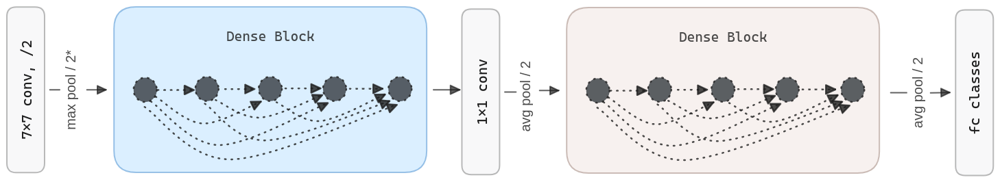

import Highlight from '../../components/Highlight.astro';

## Abstract

DenseNets have several important contributions to the field of computer vision, including:  

1. **Addressing the vanishing gradient problem**: DenseNets <Highlight color="green">connect each layer to every other layer</Highlight> in a feedforward manner, allowing for a direct flow of gradients throughout the network. This helps to alleviate the vanishing gradient problem and enables the efficient training of very deep networks.

2. **Reducing the number of parameters**: By connecting each layer to every other layer, DenseNets can <Highlight color="yellow">reuse feature maps from earlier layers, reducing the number of parameters needed in the network</Highlight>. This makes them more memory-efficient and easier to train than traditional convolutional neural networks (CNNs).

3. **Improving feature propagation**: The dense connectivity in DenseNets allows for more direct information flow between layers, which leads to improved feature propagation and feature reuse. This, in turn, results in better model accuracy, especially for smaller datasets.

## Main Ideas  

<Highlight color="cyan">For each layer, the feature maps of all preceding layers are used as inputs</Highlight>, and its own feature-maps are used as inputs into all subsequent layers.  With this, authors alleviate the vanishing-gradient problem, strengthen feature propagation, encourage feature reuse, and substantially reduce the number of parameters.

To ensure maximum information flow between layers in the network, all layers are connected (with matching feature-map sizes) directly with each other. To preserve the feed-forward nature, each layer obtains additional inputs from all preceding layers and passes on its own feature maps to all subsequent layers. Authors <Highlight color="green">combine features by concatenating them</Highlight>.



**Dense connectivity**. To further improve the information flow between layers, we propose a different connectivity pattern: we introduce direct connections from any layer to all subsequent layers. Consequently, the $l^{th}$ layer receives the feature maps of all preceding layers, $x_0, \dots, x_{l-1}$, as input: $x_l = H_l([x_o, x_1, \dots, x_{l-1}])$ where $[x_o, x_1, \dots, x_{l-1}]$ refers to the concatenation of the feature maps produced in layers $0, \dots, l-1$.

**Pooling layers**. The concatenation operation is not viable when the size of feature maps changes. However, an essential part of convolutional networks is down-sampling layers that change the size of feature maps. <Highlight color="yellow">To facilitate down-sampling in the architecture, we divide the network into multiple densely connected dense blocks</Highlight>. We refer to <Highlight color="brown">layers between blocks as transition layers</Highlight>, which do convolution and pooling. The transition layers used in the experiments consist of a batch normalization layer and a 1×1 convolutional layer followed by a 2×2 average pooling layer. 

**Growth rate**. If <Highlight color="green">each function Hₗ produces k feature maps</Highlight>, it follows that the $l^{th}$ layer has $k_o + k \times(l-1)$ input feature maps, where $k_0$ is the number of channels in the input layer. An important difference between DenseNet and existing network architectures is that DenseNet can have very narrow layers, e.g., k = 12. <Highlight color="green">We refer to the hyperparameter k as the growth rate of the network</Highlight>.

**Bottleneck layers**. Although each layer only produces k output feature maps, it typically has many more inputs. <Highlight color="purple">A 1×1 convolution can be introduced as a bottleneck layer before each 3×3 convolution to reduce the number of input feature maps and thus improve computational efficiency</Highlight>. We find this design especially effective for DenseNet

## Code

The DenseLayer receives the concatenated feature maps from all previous layers and produces k new feature-maps using a 3×3 convolution. Note that previously, the number of feature-maps is reduced by a 1×1 convolution.

```python
class DenseLayer(nn.Module):
	def __init__(self, num_input_features, growth_rate, bn_size):	
		super(DenseLayer, self).__init__()
		
		self.norm1 = nn.BatchNorm2d(num_input_features)		
		self.relu1 = nn.ReLU(inplace=True)		
		self.conv1 = nn.Conv2d(		
			num_input_features, bn_size * growth_rate,		
			kernel_size=1, stride=1, bias=False		
		)
		
		self.norm2 = nn.BatchNorm2d(bn_size * growth_rate)		
		self.relu2 = nn.ReLU(inplace=True)		
		self.conv2 = nn.Conv2d(		
			bn_size * growth_rate, growth_rate,		
			kernel_size=3, stride=1, padding=1, bias=False		
		)
		
	def forward(self, concated_features):	
		bottleneck_output = self.conv1(
			self.relu1(self.norm1(concated_features))
		)		
		new_features = self.conv2(
			self.relu2(self.norm2(bottleneck_output))
		)
		return new_features
```

If we take this DenseLayer and stack it several times, we get a DenseBlock. We can see how the features that every DenseLayer produce are concatenated over the `features` list and passed to the next DenseLayer. Also, the number of input features is increased by the growth rate at each iteration.  

```python
class DenseBlock(nn.ModuleDict):
	def __init__(self, num_layers, num_input_features, bn_size, growth_rate):
		super(DenseBlock, self).__init__()
		
		self.dense_layers = []		
		for i in range(num_layers):		
			layer = DenseLayer(		
				num_input_features + i * growth_rate,		
				growth_rate=growth_rate,		
				bn_size=bn_size		
			)
			self.dense_layers.append(layer)

	def forward(self, init_features):
		features = [init_features]
		for layer in self.dense_layers:	
			concated_features = torch.cat(features, 1)		
			new_features = layer(concated_features)		
			features.append(new_features)
		
		return torch.cat(features, 1)
```

The last building block is the transition layer, which is composed of a batch normalization layer and a 1×1 convolutional layer followed by a 2×2 average pooling layer.  

```python
class Transition(nn.Sequential):
	def __init__(self, num_input_features, num_output_features):	
		super(Transition, self).__init__()
		
		self.norm = nn.BatchNorm2d(num_input_features)		
		self.relu = nn.ReLU(inplace=True)		
		self.conv = nn.Conv2d(		
			num_input_features, num_output_features,		
			kernel_size=1, stride=1, bias=False		
		)
		
		self.pool = nn.AvgPool2d(kernel_size=2, stride=2)
	  
	def forward(self, x):	
		out = self.conv(self.relu(self.norm(x)))		
		out = self.pool(out)		
		return out
```

With these three building blocks, we can define the DenseNet architecture.  

```python
class DenseNet(nn.Module):
	"""
	Args:
		growth_rate (int): num filters to add each layer (`k` in paper)
		block_config (list<int>): layers in each pooling block
		num_init_features (int): filters in the first convolution layer
		bn_size (int): multiplicative factor for bottle neck layers
					   (i.e. bn_size * k features in the bottleneck layer)
		num_classes (int) - number of classification classes
	"""
	def __init__(
		self, growth_rate=32, block_config=[6, 12, 24, 16],
		num_init_features=64, bn_size=4, num_classes=1000
	):	  
	
		super(DenseNet, self).__init__()
		
		# First convolution	
		self.features = nn.Sequential(	
			nn.Conv2d(	
				3, num_init_features,	
				kernel_size=7, stride=2, padding=3, bias=False	
			),	
			nn.BatchNorm2d(num_init_features),	
			nn.ReLU(inplace=True),	
			nn.MaxPool2d(kernel_size=3, stride=2, padding=1),	
		)
		
		# Each denseblock	
		num_features = num_init_features	
		for i, num_layers in enumerate(block_config):		
			block = DenseBlock(		
				num_layers=num_layers,		
				num_input_features=num_features,		
				bn_size=bn_size,		
				growth_rate=growth_rate		
			)
			
			self.features.append(block)		
			num_features = num_features + num_layers * growth_rate		
			if i != len(block_config) - 1:		
				trans = Transition(			
					num_input_features=num_features,			
					num_output_features=num_features // 2			
				)			
				self.features.append(trans)			
				num_features = num_features // 2
			  
		# Final batch norm	
		self.features.append(nn.BatchNorm2d(num_features))	  
		
		# Linear layer	
		self.classifier = nn.Linear(num_features, num_classes)
	
	
	def forward(self, x):	
		features = self.features(x)		
		out = F.relu(features, inplace=True)		
		out = F.adaptive_avg_pool2d(out, (1, 1))		
		out = torch.flatten(out, 1)		
		out = self.classifier(out)		
		return out
```

## References
- [Paper - Densely Connected Convolutional Networks](https://arxiv.org/abs/1608.06993)
- <a href="/diagrams/densenet.excalidraw" download="densenet.excalidraw">DenseNet Excalidraw diagram source</a> 