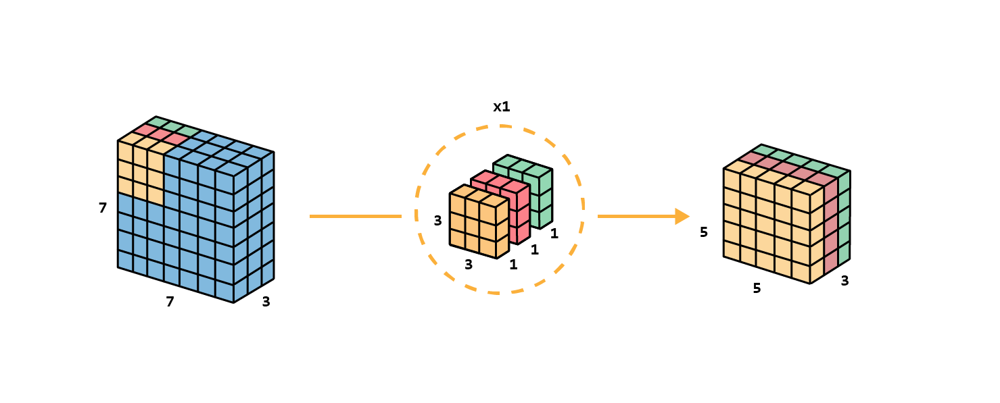
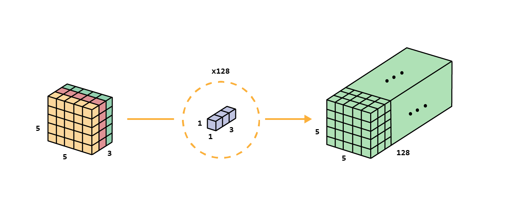
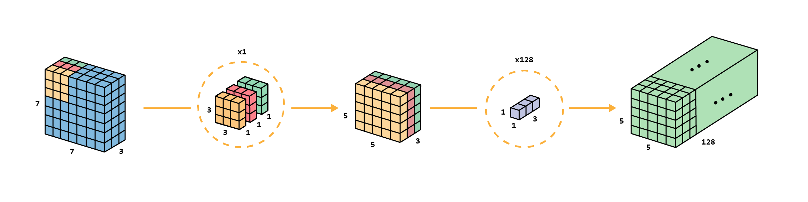

import Highlight from '../../components/Highlight.astro';

Commonly used in networks as [MobileNet](./mobilenetv1), the depthwise separable convolutions consists of two steps: depthwise convolutions and $1\times1$ convolutions.

## Standard convolution  

Before describing the depthwise separable convolution, it is worth revisiting the typical convolution. For a concrete example, let's say an input layer of size $7\times7\times3$ (height $\times$ width $\times$ channels), and 128 filters of size $3\times3\times3$, after applying one filter, the output layer is of size $5\times5\times1$ (only 1 channel), and grouped up with the 128 filters, $5\times5\times128$.


Illustrated through code:
```python
# Input volume with depth 3 and outputs 128 kernels
# Uses 3×3 convolutional kernel
conv_layer = nn.Conv2d(in_channels=3, out_channels=128, kernel_size=3)
```

## Depthwise Separable Convolutions

Let's see how we can achieve the <Highlight color="yellow">same transformation</Highlight> as the standard convolution <Highlight color="cyan">with less computation</Highlight>.

We **first** apply <Highlight color="brown">depthwise convolution</Highlight> to the input layer. Instead of using a single filter of size $3\times3\times3$, we will use 3 <Highlight color="red">kernels separately</Highlight>. Each filter has a size of $3\times3\times1$, each kernel convolves with 1 channel of the input layer (<Highlight color="red">1 channel only, not all channels!</Highlight>). Each such convolution, in the example, will provide a map of size $5\times5\times1$, and **we will stack them** to create a $5\times5\times3$ image. We shrunk the spatial dimension, **but the depth is still the same as before**.


Then, it's time for the **second** step, <Highlight color="purple">extend the depth by applying $1\times1$ convolutions</Highlight>, as many as the depth we want to achieve, as for the example 128 filters.


With these steps, we also (as in the standard convolution) transform the input layer $7\times7\times3$ into the output layer $5\times5\times128$ as for the standard convolution. The overall process of the depthwise separable convolution would be:


Which would be defined as:
```python
# Define depthwise separable convolutional layer
# Note how we use the groups parameter: At groups equals to in_channels,
# each input channel is convolved with its own set of filters
depthwise_conv_layer = nn.Conv2d(
	in_channels=3, out_channels=3, kernel_size=3, groups=3
)
pointwise_conv_layer = nn.Conv2d(
	in_channels=3, out_channels=128, kernel_size=1
)
```

The advantage of doing depthwise separable convolutions is the **<Highlight color="cyan">efficiency</Highlight>**. One needs much <Highlight color="cyan">less operations</Highlight> for depthwise separable convolutions compared to standard convolutions.

Meanwhile for the standard convolutions we need to move 128 filters with dimensionality $3\times3\times3$ around the input $5\times5$ times, i.e., $128\times3\times3\times5\times5 =$ **86400 multiplications**, the depthwise separable convolution uses 3 kernels $3\times3\times1$ that moves $5\times5$ times, and after that, 128 filters of dimensionality $1\times1\times3$ that moves $5\times5$ times over the previous output, i.e., $3\times3\times3\times1\times5\times5 + 128\times1\times1\times3\times5\times5 =$ **9600 multiplications**, <Highlight color="yellow">only about the 12% of the cost of the standard convolution</Highlight> (for this example convolution configuration).


## References
- [A Comprehensive Introduction to Different Types of Convolutions in Deep Learning](https://towardsdatascience.com/a-comprehensive-introduction-to-different-types-of-convolutions-in-deep-learning-669281e58215)
- [Designing Faster Neural Networks](https://medium.com/@dmangla3/designing-faster-neural-networks-e1f1dc026533)
