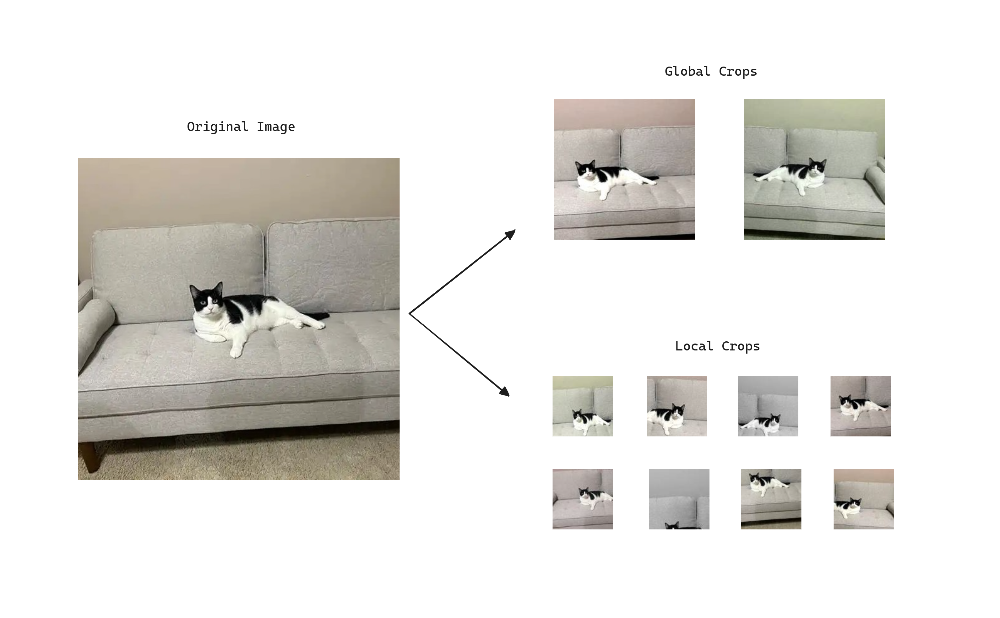
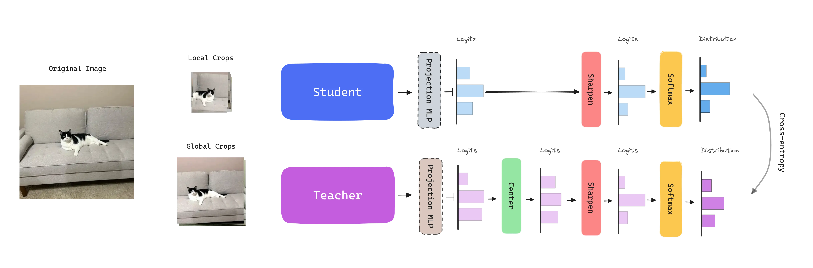
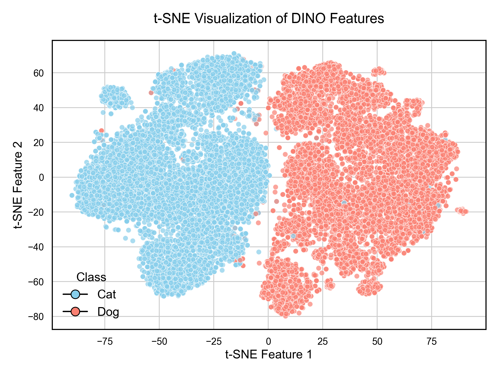
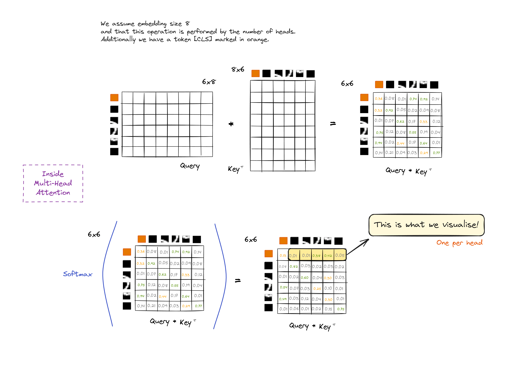
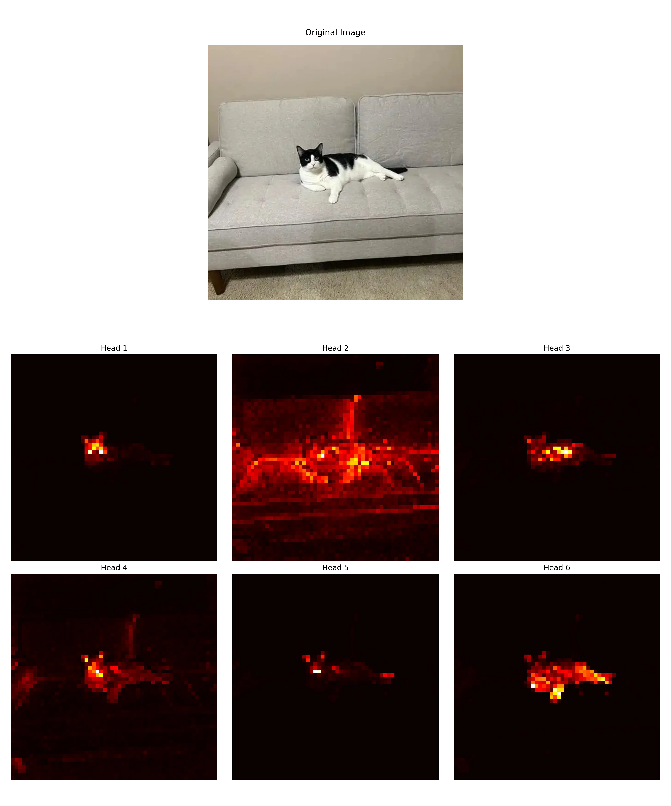

import Highlight from '../../components/Highlight.astro';

## Abstract

DINO, a self-**di**stillation with **no** labels framework, falls into the category of <Highlight color="green">representation learning</Highlight> algorithms. It aims to <Highlight color="cyan">learn effective representations of image data without labeled datasets</Highlight>, in a <Highlight color="green">self-supervised</Highlight> fashion. This representation can be used for many tasks, such as classification, retrieval, or transfer learning.

Furthermore, learned features explicitly contain the <Highlight color="brown">scene layout</Highlight>, in particular, object boundaries, directly accessible in the self-attention modules of the last block of the network.

## DINO

Image-level supervision often reduces the rich visual information contained in an image to a single concept selected from a predefined set of a few thousand categories of objects. Inheriting from the success of [Transformers](./transformer) in NLP thanks to self-supervised pre-training, DINO aims to <Highlight color="yellow">create a pretext task that provide a richer signal than the supervised objective</Highlight>.

DINO simplifies self-supervised training by directly predicting the output of a teacher network, *built with a momentum encoder*, by using a standard cross-entropy loss.

### Student-Teacher Framework  

DINO follows a <Highlight color="red">knowledge distillation</Highlight> learning paradigm, where a <Highlight color="cyan">student</Highlight> network $g_{\theta s}$ is trained to <Highlight color="orange">match the output</Highlight> of a <Highlight color="cyan">teacher</Highlight> network $g_{\theta t}$, parameterized by $\theta_s$ and $\theta_t$, respectively. Both networks share the same architecture, which is a [Vision Transformer](./vit) in this case. A MLP projection head with $K$ dimensions is attached to align the outputs of the networks. The features used in downstream tasks come from the `CLS` token from the ViT backbone.  

To adapt the problem to <Highlight color="yellow">self-supervised learning</Highlight>, given an image $x$ DINO constructs different distorted views or <Highlight color="yellow">crops of an image</Highlight> by using a **multi-crop strategy**. Specifically, the standard setting for multi-crop training is to use 2 global views at resolution $224^2$ covering an area $>50\%$ of the image, and several local views at resolution $96^2$ with small areas covering $< 50\%$ of the image.

<Highlight color="green">Global and local crops are passed through the student network, while only the global ones are passed through the teacher</Highlight>. This encourages the <Highlight color="brown">teacher to give us generally a better representation</Highlight> and lead the learning process, as global views have more information compared to the local views that the student receives. At the same time, <Highlight color="yellow">the student with local views learn to recognize fine-grained details and becomes invariant to scale changes</Highlight>.



Given an input image $x$, *the crops*, both networks output probability distributions over $K$ dimensions, obtained by normalizing the output of the networks with a softmax function. Given a fixed teacher network $g_{\theta t}$, we learn to match these distributions by minimizing the <Highlight color="green">cross-entropy loss</Highlight>.

<Highlight color="yellow">The student parameters</Highlight> $\theta_s$ are learned by minimizing the cross-entropy loss between the student and teacher outputs with stochastic gradient descent.

<Highlight color="yellow">The teacher parameters</Highlight> $\theta_t$ are not given a *priori* and are dynamically built during training. To do so, the <Highlight color="yellow">teacher network is freezed over an epoch and updated using an exponential moving average (EMA) on the student weights</Highlight>, i.e., a momentum encoder. The update rule is $\theta_t \leftarrow \lambda \theta_t + (1 - \lambda) \theta_s$, with $\lambda$ following a cosine schedule from 0.996 to 1 during training. This leads the teacher to stabilize and provide a more robust signal to the student.



The models are trained on the ImageNet dataset without labels. For evaluation 20 nearest neighbors are retrieved using the cosine similarity between the features of the images. It can be observed that reducing the size of the patches has a bigger impact on the performance than training larger models.

### Avoiding Collapse: Sharp & Center

One problem DINO has is that the <Highlight color="cyan">learnt representations can easily collapse</Highlight>, i.e., make the model output the same embedding for every image regardless of the input. Why not to output the same embedding for every image and technically have no error?  

There are two forms of collapse: regardless of the input, the model output is uniform along all dimensions or <Highlight color="yellow">dominated by one dimension</Highlight>.

To avoid this, DINO introduces two strategies applied to the logits:

- **Centering**: Avoids the collapse induced by a dominant dimension. Depends on first-order batch statistics and can be interpreted as adding a bias term $c$ to the teacher: $g_t(x) \leftarrow g_t(x)+c$. The center $c$ is updated with an exponential moving average. Applied just to the teacher.

- **Sharpening**: The model is encouraged to output sharp predictions by using a temperature scaling factor. This factor is applied to the logits before the Softmax function. Applied to the student and teacher.  

Authors found that the combination of both strategies is crucial to avoid collapse and achieve good performance. If one operation is missing, the Kullback-Leiber divergence converges to zero, indicating a collapse.

## Applications

### Feature extraction: KNN classification
  
The authors demonstrate throughout the paper that DINO is capable of extracting rich self-supervised features that perform particularly well even with a basic nearest neighbors classifier and without any fine-tuning. In this section we test the features extracted from the `CLS` token of the ViT backbone on the [Dogs vs. Cats Kaggle dataset](https://www.kaggle.com/competitions/dogs-vs-cats/data?select=train.zip).

First we load the model and extract the features from the `CLS` token of the last block of the network.

```python
# -- Import the necessary libraries --
# Load the DINO model
model = torch.hub.load('facebookresearch/dino:main', 'dino_vits8')
model.eval() # move the model to some device if needed
 
# Define the basic transformations
transform = transforms.Compose([
	transforms.Resize(256, interpolation=3),
	transforms.CenterCrop(224),
	transforms.ToTensor(),
	transforms.Normalize((0.485, 0.456, 0.406), (0.229, 0.224, 0.225)),
])
  
# -- Create your dataset and dataloader --
# Extract the features
features, labels, image_names = [], [], []
with torch.no_grad():
	for batch, label, names in tqdm(dataloader):		
		output = model(batch.to(device))		
		features.append(output.cpu().numpy())		
		labels.extend(label.cpu().numpy())		
		image_names.extend(names)
		  
# Group features
features = np.concatenate(features)
```

Now, we can visualize the features using a t-SNE plot, by reducing the dimensionality of the features to 2D.  

```python
# Apply t-SNE
tsne = TSNE(n_components=2, random_state=42)
features_tsne = tsne.fit_transform(features)
```

If we create a scatter plot of the features and color them by the class, we can observe that the features are well separated.



Finally, we can use a k-NN classifier to classify the images by using the features extracted.

```python
# Split the data into training and validation sets
X_train, X_val, y_train, y_val, names_train, names_val = train_test_split(
	features, labels, image_names,
	test_size=0.2, random_state=42, stratify=labels
) 

# Create and train the KNN classifier
knn = KNeighborsClassifier(n_neighbors=20)
knn.fit(X_train, y_train) 

# Make predictions on the validation set
y_pred = knn.predict(X_val)
accuracy = accuracy_score(y_val, y_pred)
``` 

The evaluation of the model shows that the model is capable of achieving a $+99\%$ accuracy with a simple k-NN classifier.

### Feature visualization: Scene layout 

DINO self-attention maps contain information about the segmentation of an image. Particularly, the self-attention maps of the last block of the network contain information about the object boundaries, where <Highlight color="green">different heads can attend to different semantic regions</Highlight>.


```python
# Import the necessary libraries
from PIL import Image
import matplotlib.pyplot as plt
import torch
from torchvision import transforms
  
# Load the model
model = torch.hub.load('facebookresearch/dino:main', 'dino_vits8')
model.eval()
  
# Load an image
image_path = "cat.jpg"
with open(image_path, 'rb') as f:
	img = Image.open(f)
	img = img.convert('RGB')

# Preprocess the image
image_size = (448, 448)
transform = transforms.Compose([
	transforms.Resize(image_size),
	transforms.ToTensor(),
	transforms.Normalize((0.485, 0.456, 0.406), (0.229, 0.224, 0.225)),
])
img = transform(img)
  
# make the image divisible by the patch size
patch_size = 8
w = img.shape[1] - img.shape[1] % patch_size
h = img.shape[2] - img.shape[2] % patch_size
img = img[:, :w, :h].unsqueeze(0)
  
# forward the image
with torch.no_grad():
	attentions = model.get_last_selfattention(img.to(device))
	# attentions shape => (batch, num_heads, num_patches+1, num_patches+1)
	# remember we have added the [CLS] token to the sequence (+1)
  
# we keep only the output patch attention
# We display the self-attention for [CLS] token query (index 0)
# and remove the entry for the [CLS] token query (apply 1:)
attentions = attentions[0, :, 0, 1:] # (num_heads, num_patches-1)
  
# reshape the attentions to the square spatial shape
nh = attentions.shape[0] # number of heads
ph = img.shape[2] // patch_size # number of patches along height
pw = img.shape[3] // patch_size # number of patches along width
attentions = attentions.reshape(nh, pw, ph)
  
# resize to the original image size
attentions = torch.nn.functional.interpolate(
	attentions.unsqueeze(0), scale_factor=patch_size, mode="nearest"
).numpy()
  
# Visualize the attentions
# Create a figure with 2 rows and 3 columns (we have 6 attention heads)
fig, axes = plt.subplots(2, 3, figsize=(15, 10))
  
# Flatten the axes array to easily iterate over it
axes = axes.flatten()

# Plot each slice of the matrix
for i in range(6):
	im = axes[i].imshow(attentions[i], cmap="hot", interpolation="nearest")
	axes[i].set_title(f'Head {i+1}')
	axes[i].axis('off') # Turn off axis labels

# Adjust the layout and display the plot
plt.tight_layout()
plt.show()
```

Next there is an example of how the attention maps of the last block of the network look like.


## FAQ

- **Why do the features used in downstream tasks come from the ViT backbone rather than the projection head?**
	- Just like traditionally in Convolutional Neural Networks (CNNs), the features used in downstream tasks come from earlier layers of the network instead of the last layer. The <Highlight color="yellow">ViT backbone is designed to learn general features</Highlight> that capture a wide range of visual concepts. On the other hand, <Highlight color="yellow">the projection head is more task-specific</Highlight>, reducing the dimensionality of the features and learning a representation that is more suitable for the specific task at hand, discarding information that could be useful for other tasks. Finally, the projection head is a simple MLP, which may not preserve spatial information crucial for many downstream tasks.  

- **Why is centering only applied to the teacher and sharpening to both the student and the teacher? Could we not apply centering to both?**
	- My theory: Probably trial and error. My theory is that an imbalance is needed so applying the same operations not lead us again to collapse. The author responded: "I think we could also apply centering to the student as well though this is not critical to prevent collapse".

## References

- [Paper - Emerging Properties in Self-Supervised Vision Transformers](https://arxiv.org/abs/2104.14294)
- [DINO - Original Pytorch Implementation](https://github.com/facebookresearch/dino)

- <a href="/diagrams/dino.excalidraw" download="dino.excalidraw">DINO Excalidraw diagram source</a>
- <a href="/notebooks/dino_knn.ipynb" download="dino-knn.ipynb">DINO KNN Notebook</a>
- <a href="/notebooks/dino_multi-crops.ipynb" download="dino-multi-crops.ipynb">DINO Multi-Crops Notebook</a>
- <a href="/notebooks/dino_visualize_attention.ipynb" download="dino-visualize-attention.ipynb">DINO Visualize Attention Notebook</a>