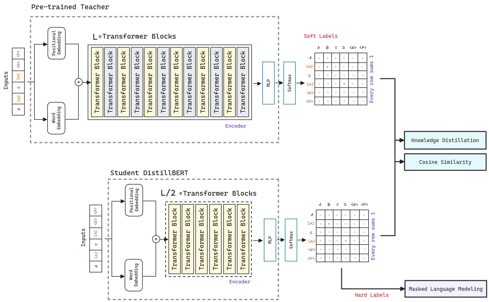

import Highlight from '../../components/Highlight.astro';

## Abstract
Research on pre-trained models indicate that training even larger models still leads to better performances on downstream tasks. However, operating large-scale pre-trained models in on-the-edge and/or under constrained computational training or inference budgets remains challenging. 

DistillBERT proposes a method to pre-train a smaller general-purpose language representation model. Through knowledge distillation during the pre-training phase authors show that is possible to reduce the size of a [BERT](./bert) model by 40% while retaining 97% of its language understanding capabilities and being 60% faster. To achieve this, authors introduce a <Highlight color="green">triple loss combining language modeling, distillation and cosine-distance losses</Highlight>.

## Architecture

DistilBERT uses a student-teacher framework, where <Highlight color="yellow">the student is trained to mimic the teacher's predictions, also known as knowledge distillation</Highlight>.

The teacher is a $BERT_{BASE}$ model. The student, DistillBERT, has the same general architecture but the *token-type embeddings* and the *pooler* are removed while the number of layers is reduced by a factor of 2. Investigations show that variations in the hidden size dimension have a smaller impact on computation efficiency, so <Highlight color="red">DistilBERT focus on reducing the number of layers</Highlight>.

An important element in the training procedure is to find the right initialization for the student to converge. Taking advantage of the common dimensionality between teacher and student networks, <Highlight color="green">DistilBERT initializes the student's weights from the teacher by taking one layer out of two</Highlight>.

Finally, following previous approaches like [RoBERTa](./roberta), DistilBERT uses a <Highlight color="yellow">dynamic masking strategy without the next sentence prediction objective</Highlight>. Also, the student is distilled on very large batches leveraging gradient accumulation, up to 4K examples per batch.

## Training Losses

To leverage the inductive biases learned by larger models during pre-training, DistillBERT introduces a triple loss combining masked language modeling, distillation and cosine-distance losses. <Highlight color="yellow">The final loss is a linear combination of the three losses</Highlight>.

### Masked Language Modeling

As in the original [BERT](./bert) model, DistillBERT uses a masked language model (MLM) to train the model to predict the original vocabulary id of the masked word based only on its context.

### Knowledge Distillation

Knowledge distillation is a compression technique in which a compact model- <Highlight color="green">the student</Highlight> - is trained to <Highlight color="yellow">reproduce the behaviour</Highlight> of a larger model - <Highlight color="yellow">the teacher</Highlight> - or an ensemble of models.

**The teacher** is first trained to predict an instance class by maximizing the estimated probability of gold labels. A standard objective thus involves minimizing the cross-entropy between the model's predicted distribution and the one-hot empirical distribution of training labels. A model performing well on the training set will predict an output distribution with high probability on the correct class and with near-zero probabilities on other classes. But some of these *near-zero* probabilities are larger than others and reflect, in part, the generalization of the model and how well it will perform on the test set.

**The student** is then trained with a distillation loss over the <Highlight color="cyan">soft target probabilities of the teacher</Highlight>.

### Cosine-Distance

Authors found beneficial to add a <Highlight color="green">cosine embedding loss</Highlight> which tends to <Highlight color="yellow">align the directions of the student and teacher hidden states</Highlight>.

This way, the student is likely not only to reproduce masked tokens correctly but also to <Highlight color="blue">construct embeddings that are similar to those of the teacher</Highlight>.

_Pytorch already includes a <a href="https://pytorch.org/docs/stable/generated/torch.nn.CosineEmbeddingLoss.html#torch.nn.CosineEmbeddingLoss" target="_blank">cosine embedding loss</a>._

## References

- [Paper - DistilBERT, a distilled version of BERT: smaller, faster, cheaper and lighter](https://arxiv.org/abs/1910.01108)
- [Pytorch Tutorial about Knowledge Distillation & Cosine Embedding Loss](https://pytorch.org/tutorials/beginner/knowledge_distillation_tutorial.html)
- [Vyacheslav Efimov Medium Post about DistillBERT](https://towardsdatascience.com/distilbert-11c8810d29fc)
- <a href="/diagrams/distillbert.excalidraw" download="distillbert.excalidraw">DistillBERT Excalidraw diagram source</a>
- <a href="/notebooks/distillbert-cosine.ipynb" download="distillbert.ipynb">DistillBERT Notebook testing cosine similarity between sentences</a>