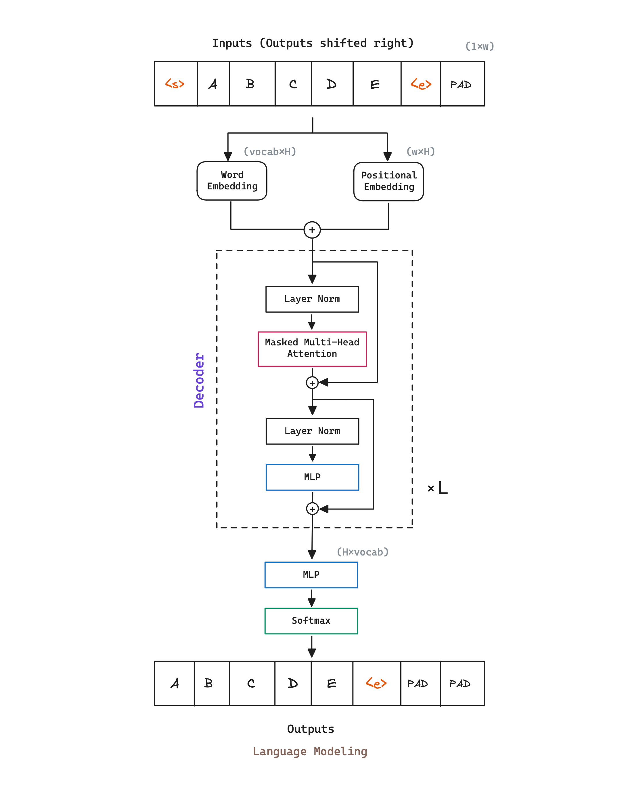

import Highlight from '../../components/Highlight.astro';

## Abstract

GPT explores a semi-supervised approach for language understanding tasks using a combination of <Highlight color="yellow">unsupervised pre-training</Highlight>, assuming access to a large corpus of unlabeled text, and datasets with manually annotated training examples for <Highlight color="yellow">supervised fine-tuning</Highlight>.

To do so, GPT employ a two-stage training procedure:
1. First, it uses a language modeling objetive on the unlabeled data to learn the initial parameters of a neural network model.
2. Subsequently, it adapts the model parameters to a target task using the corresponding supervised objective.

Furthermore, this approach showcases zero-shot behaviors of the pre-trained model on different settings, demonstrating that GPT acquires useful linguistic knowledge for downstream tasks during the unsupervised pre-training phase.

## Architecture

GPT model architecture is a multi-layer <Highlight color="brown">causal Transformer Decoder</Highlight>, almost identical to the original [[Transformer - Attention Is All You Need|Transformer]] implementation.  

We can denote the number of the Transformer decoder blocks as $L$, the hidden size as $H$, and the number of self-attention heads as $A$. GPT initial model design is the following:

| Model Name | $L$ (Transformer blocks) | $H$ (Hidden size) | $A$ (Self-Attention heads) |
| ---------- | ------------------------ | ----------------- | -------------------------- |
| $GPT$      | 12                       | 768               | 12                         |

Additionally, GPT uses a bytepair encoding (BPE) vocabulary with $40.000$ merges. Authors use the [ftfy library](https://ftfy.readthedocs.io/en/latest/) to clean the raw text in BookCorpus dataset, standardize some punctuation and whitespace, and use the [spaCy tokenizer](https://spacy.io).

## Pre-training 

Learn effectively from raw text is crucial to alleviating the dependence on supervised learning. Even in cases were considerable supervision is available, learning good representations in an unsupervised fashion can provide a significant performance boost.

Given a <Highlight color="yellow">unsupervised corpus</Highlight> of tokens, GPT uses a standard <Highlight color="green">language modeling objective</Highlight> to maximize the likelihood. This task consists of <Highlight color="green">predicting a token given its previous context</Highlight>. As in the Transformer, this task can be performed in an <Highlight color="yellow">unsupervised</Highlight> way by taking sequences of tokens and adding a padding on the initial input, typically a special token, `<s>` for our illustration.

## Fine-tuning

After training the model, GPT <Highlight color="cyan">adapts the parameters to a supervised target task</Highlight>. To do so, a labeled dataset $C$ is used, where each instance consists of a sequence of input tokens, $x^1, \dots, x^m$, along with a label $y$. The input are passed through the pre-trained model to obtain the final transformer block's activation $h_{l}^{m}$ (`<e>`), which is then fed into an added linear output layers with parameters $W_y$ to predict $y$.

Authors additionally found that <Highlight color="yellow">including language modeling as an auxiliary objective</Highlight> to the fine-tuning helped improving generalization and accelerating convergence.

GPT setup does not require fine-tuning target tasks to be in the same domain as the unlabeled corpus used during pre-training. During transfer, GPT utilizes task-specific input adaptations, always processing structured text input as a single contiguous sequence of tokens. Taking that into account, <Highlight color="yellow">minimal changes to the architecture of the pre-trained model are done</Highlight>.

### Task-specific input transformations

For some tasks, like text classification, we can directly fine-tune GPT as described above. For other tasks, it is possible to convert structured inputs into an ordered sequence that the pre-trained model can process. These input transformations allow GPT to avoid making extensive changes to the architecture across tasks.  

- **Textual entailment**. For entailment tasks, simply concatenate the premise $p$ and hypothesis $h$ token sequences, with a delimiter token ($) in between. Process and obtain final transformer block's activation.
- **Similarity**. For similarity tasks there is no inherent ordering of the two sentences being compared. To reflect this, authors modify the input sequence to obtain both possible sentence orderings and process each independently to produce two sequence representations $h_{l}^{m}$ which are added element-wise before being fed into the linear output layer.
- **Question Answering and Commonsense Reasoning**. For these tasks, we are given a context document $z$, a question $q$, and a set of possible answers $\{a_{k}\}$. Authors concatenate the document context and question with each possible answer, adding a delimiter token in between to get $[z; q; \text{\textdollar}; a_k]$. Each of these sequences are processed independently to obtain scores that are later normalized via a softmax layer to produce an output distribution over possible answers.

## Glossary

- **$L$**: Number of Transformer decoder blocks.
- **$H$**: Size of the embeddings. An embedding is a learnable representation of the words of the vocabulary.
- **$A$**: Number of self-attention heads.
- **w**: Input sequence length.

## References

- [Paper - Improving Language Understanding by Generative Pre-Training](https://cdn.openai.com/research-covers/language-unsupervised/language_understanding_paper.pdf)
- [nanoGPT - Pytorch Implementation](https://github.com/karpathy/nanoGPT)
- <a href="/diagrams/gpt1.excalidraw" download="gpt1.excalidraw">GPT1 Excalidraw diagram source</a>
