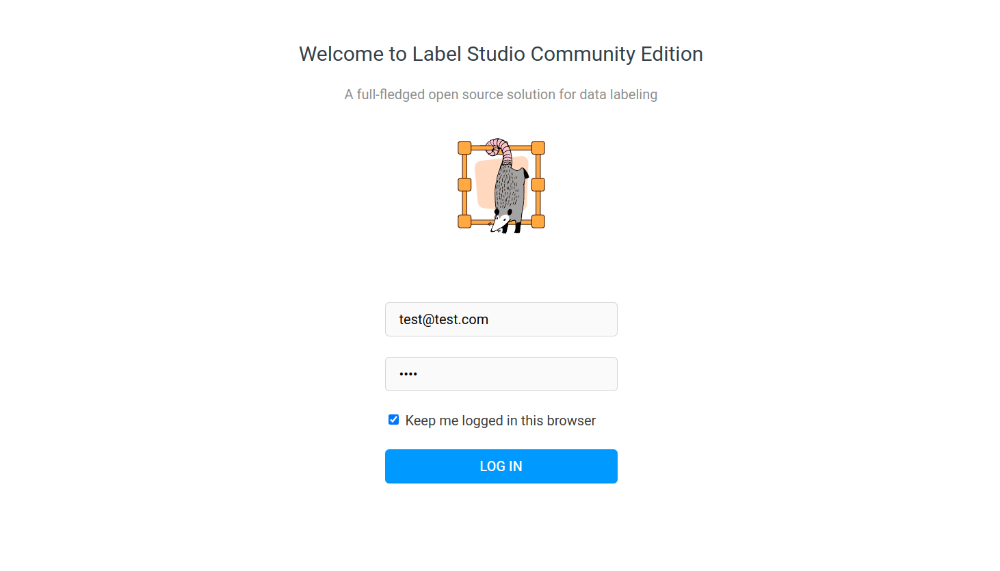
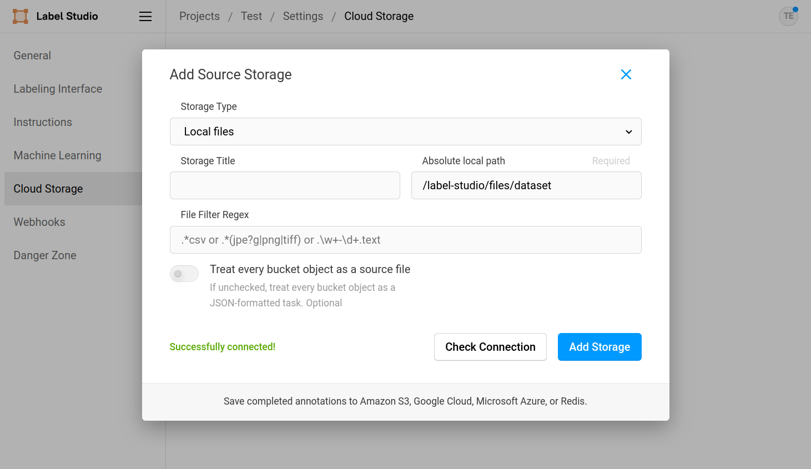

## Introduction

Loading data when using Label Studio can be accomplished in various ways.
The easiest one is to drag and drop a file into the interface,
but this is not always the best option, scpecially when dealing with large datasets.

In this post we will see how to load data from a **JSON file**, configuring the Label Studio server
to serve the files from a **local directory**.

## Label Studio Setup

The first thing we will need to do is to run the Label Studio server.
We can do this by running the following command in the terminal:

```bash
docker run -d -p 8080:8080 \
--env LABEL_STUDIO_LOCAL_FILES_SERVING_ENABLED=true \
--env LABEL_STUDIO_LOCAL_FILES_DOCUMENT_ROOT=/label-studio/files \
-v /datadrive/labeling/myfiles:/label-studio/files \
--env LABEL_STUDIO_DISABLE_SIGNUP_WITHOUT_LINK=true \
--env LABEL_STUDIO_USERNAME=test@test.com \
--env LABEL_STUDIO_PASSWORD=test \
--name label-studio \
--restart=always \
heartexlabs/label-studio:latest label-studio
```

Here we are running the Label Studio server in a Docker container,
specifying that we will use the local storage. We are also mounting a local machine directory
 `/datadrive/labeling/myfiles` to the container's `/label-studio/files` directory,
 so that we can access the files from the container. The main parameters for **local file serving** are:

- **`LABEL_STUDIO_LOCAL_FILES_SERVING_ENABLED=true`** enables the local file serving feature.
- **`LABEL_STUDIO_LOCAL_FILES_DOCUMENT_ROOT=/label-studio/files`** sets the container's root directory for the local file serving feature.
- **`-v /datadrive/labeling/myfiles:/label-studio/files`** mounts the local directory `/datadrive/labeling/myfiles` to the container's `/label-studio/files` directory, so that we can access our local machine files from the container.

We are also setting some interesting parameters for the Label Studio server:

- **`LABEL_STUDIO_DISABLE_SIGNUP_WITHOUT_LINK=true`** disables the signup feature, so that only users with a signup link can register (we can obtain the signup link when log in with the defined user).
- **`LABEL_STUDIO_USERNAME=test@test.com`** sets the username for the user that will be created.
- **`LABEL_STUDIO_PASSWORD=test`** sets the password for the user that will be created.


When we run the command above, we will see that the Label Studio server is running in `http://localhost:8080`.
*Remember to change the path `/datadrive/labeling/myfiles` to the ones in your local machine.*



If you can access the server and see the login page, we are ready to go!


### Labeling configuration

For this example we are going to work simulating a problem in which
we want to annotate the class to which an image belongs,
obtaining a configuration similar to the following one:

```xml
<View>
  <Image name="image" value="$my_image"/>
  <Choices name="choice" toName="image" showInLine="true">
    <Choice value="Boeing" background="blue"/>
    <Choice value="Airbus" background="green" />
  </Choices>
</View>
```

Note that the **value** field from the `Image` component is the key that we will give later to the reference of the data we want to label.

So, once the login is done, we will go to `Create Project`, give it a name,
pass for the moment from the `Data Import` section, 
and finally at `Labeling setup` define our custom template as we have indicated.

### Data Structure

For the post, we mounted the local directory `/datadrive/labeling/myfiles` to the container's `/label-studio/files` directory.
The structure of the files in our local direcotry is the following:

```bash
/datadrive/labeling/myfiles
└── dataset
    ├── 1.jpg
    ├── 2.jpg
    └── 3.jpg
```

## Loading Local Files

In the case that we have a large dataset of files in our local machine or server,
we can use the **local file serving** feature of Label Studio to load those local files.
To do so, we only will need to **mount** our local directory to the container's `/label-studio/files` directory,
through the `-v` parameter in the `docker run` command from [Label Studio Setup](#label-studio-setup).

Then, to use our local files in the labeling, we will need to:
1. Setup the **local file serving** feature in the Label Studio project configuration.
2. Create a **JSON file** with the data we want to label.
3. Load the **JSON file** in the Label Studio project.

### Local File Serving Setup

For the **local file serving** feature to work, we will need to setup it in Label Studio project configuration.
To do so, we need to go to the project `Settings`, then to `Cloud Storage` and finally to `Add Source Storage`.
There we will need to fill the following fields:

- **Storage type**: `Local files`
- **Absolute local path**: `/label-studio/files/dataset`

If we click `Check Connection` we should see a green message indicating that the connection is successful.
We can then click `Add Storage` and we will have our local file serving setup.



We are now ready to load our data! Please **don't click** at `Sync Storage` button nor other buttons that are not clearly explained in the post.

### JSON File

The next step is to create a **JSON file** with the data we want to label.
Following the example from [Data Structure](#data-structure) to see how our data is structured,
and the key value `$my_image` from the `Image` component in the [Labeling configuration](#labeling-configuration),
we can create a **JSON file** with the following structure:

```json
[
    {
        "data": {
            "my_image": "/data/local-files/?d=dataset/1.jpg"
        }
    },
    {
        "data": {
            "my_image": "/data/local-files/?d=dataset/2.jpg"
        }
    },
    {
        "data": {
            "my_image": "/data/local-files/?d=dataset/3.jpg"
        }
    }
]
```

Notice how we append the path `/data/local-files/?d=` to the path of the file,
as well as the name of the directory where the files are located (`dataset` in our case).
We can save this file as `data.json` where we want, we are almost done!

### Load JSON File

Finally, we can load our **JSON file** in the Label Studio project.
Go to the project initial page, click `Import` button and drop the `data.json` file,
click again `Import` and we will see that the data is loaded, yay!

We should see our tasks in the project initial page, ready to be labeled!
Note how every entry in the `data.json` file is a task in the project.


## Conclusion

In this post we have seen how to load data from a **JSON file** in Label Studio,
configuring the Label Studio server to serve the files from a **local directory**.
This is a very flexible way to load data, as we can load any kind of data,
and we can also load data from cloud storages following the same logic.
If we plan to load data from cloud storages,
we will need to setup the cloud storage in the Label Studio project configuration 
for the correct cloud storage type. Note that depending the cloud storage type,
we will need to prepend a different path from `/data/cloud-files/?d=` to the file path.


## References

You can check the following links for more information about running Label Studio and loading data:

- [Label Studio - Labeling configuration playground](https://labelstud.io/playground/)
- [Run Label Studio on Docker and use Local Storage](https://labelstud.io/guide/start#Run-Label-Studio-on-Docker-and-use-Local-Storage)
- [Sync data from external storage](https://labelstud.io/guide/storage)
- [Get data into Label Studio - Example JSON format](https://labelstud.io/guide/tasks.html#Example-JSON-format)
