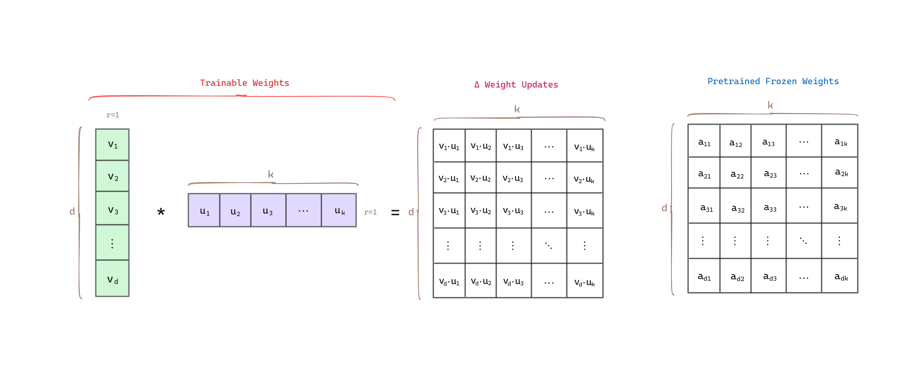
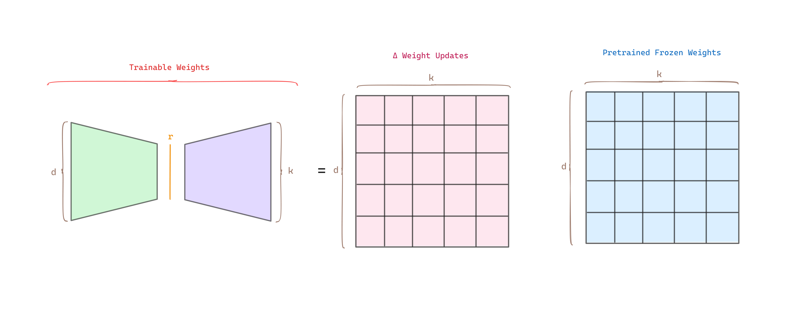
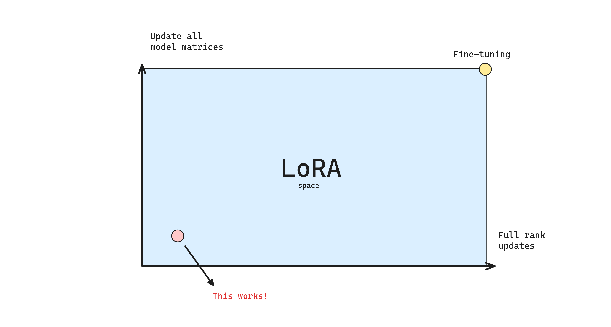
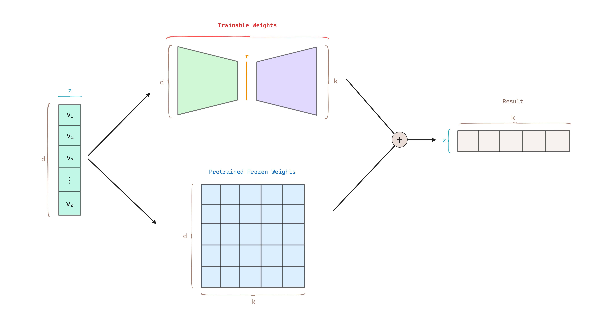
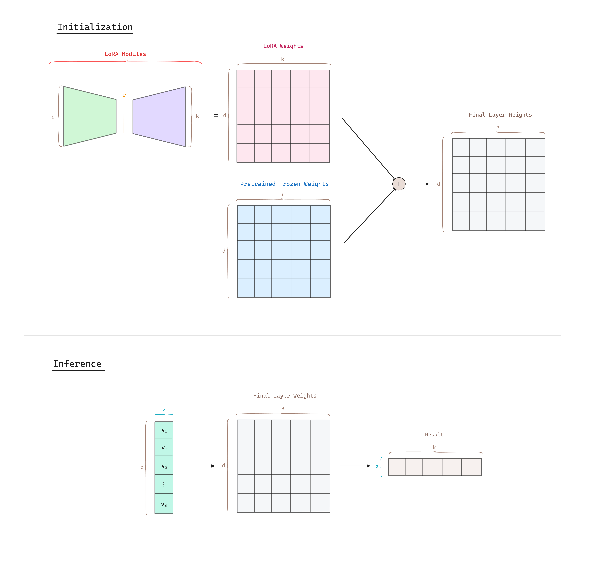

## Abstract

Do we need to fine-tune all the parameters? How expressive should the matrix updates be?

As we want to fine-tune larger models, retraining all the parameters becomes less feasible. **Lo**w-**R**ank **A**daptation (LoRA) proposes to <mark style="background: #FFF3A3A6;">freeze the pretrained model weights and inject trainable rank decomposition matrices</mark> into each layer of the architecture. LoRA reduces the trainable parameters while performing on-par than full fine-tuning.

> The principal idea apply to any dense layers in deep learning models.

## LoRA

Some [works](https://arxiv.org/abs/2012.13255) show that pre-trained models have a *low intrinsic dimension* and can still learn efficiently despite a random projection to a smaller space. LoRA hypothesizes that updating the weights also have a *low intrinsic rank* during adaptation.

For a pre-trained weight matrix $W_0 \in \mathbb{R}^{d \times k}$, LoRA constrain its update by representing the latter with a low-rank decomposition, i.e, $W_0 + \Delta W = W_0 + B A$, where $B \in \mathbb{R}^{d \times r}$ and $A \in \mathbb{R}^{r \times k}$, seeking that the rank $r \ll min(d,k)$.

During training $W_0$ is frozen and does not receive gradient updates, while $A$ and $B$ contain the trainable parameters.  

Next there is an example of how matrix decomposition works where the matrices have rank 1.

If we extend it to a general rank $r$:

Note that, as we increase the rank $r$ and LoRA is being applied to more weight matrices, LoRA becomes similar to full fine-tuning.

### Training vs. Inference

LoRA uses a random Gaussian Initialization for $A$ and zero for B, so $\Delta W = B A$ is zero at the beginning of the training. We then scale $\Delta W x$ by $\frac{\alpha}{r}$, where $\alpha$ is a constant in $r$. When optimizing with Adam, tuning $\alpha$ is roughly the same as tuning the learning rate if we scale the initialization appropriately.

Typically, $\alpha$ is set equal to $r$. A higher $\alpha$ results in smaller updates, which can lead to more stable but potentially slower learning. Conversely, a lower $\alpha$ results in larger updates, which can speed up learning but also increase the risk of instability.

<mark style="background: #ABF7F7A6;">At training</mark> time $W_0$ and $\Delta W = B A$ are multiplied with the same input, and their respective output <mark style="background: #FFF3A3A6;">vectors are summed coordinate-wise</mark>.

<mark style="background: #ABF7F7A6;">During inference</mark>, <mark style="background: #FFF3A3A6;">when initializing the model</mark>, we can <mark style="background: #FFF3A3A6;">merge the two matrices</mark> into a single matrix $W = W_0 + B A$ and apply the same input to $W$.

## Applying LoRA to Transformers  

In the Transformer architecture there are four weight matrices in the self-attention module ($W_q$, $W_k$, $W_v$, $W_o$) and two in the MLP module. Authors limit the study to **only adapting the attention weights** for downstream tasks and freeze the MLP modules.

The most significant benefit comes from the <mark style="background: #FFF3A3A6;">reduction in memory</mark> and storage usage. For a large Transformer trained with Adam, we reduce the VRAM usage by up to $2/3$ if $r \ll d_{model}$ as we do not need to store the optimizer states for the frozen parameters. This allows to train with significantly fewer GPUs and around a 25% speedup during the training compared to full fine-tuning, as we do not need to calculate the gradient for the vast majority of the parameters.

## Benefits 

- **Computing Efficiency**: LoRA makes training more efficient and lowers the hardware barrier to entry by up to 3 times when using adaptive optimizers since <mark style="background: #BBFABBA6;">LoRA does not need to calculate the grandients or maintain the optimizer states for most parameters</mark>. Instead LoRA only optimize the injected, much smaller low-rank matrices.

- **No Additional Latency**: By merging the trainable matrices with the frozen weights when deployed, $W= W_0 + BA$, introducing <mark style="background: #BBFABBA6;">no inference additional latency</mark>.

- **Task Switching**: A pre-trained model can be shared and used to build many small LoRA modules for different tasks. The shared model can be freezed and efficiently switch tasks by replacing the LoRA modules. Note that both $W_O$ and $BA$ are in $\mathbb{R}^{d \times k}$, so when we need to switch to another downstream task, we can recover $W_0$ by subtracting $BA$ and adding a different $B'A'$, a quick operation with very little memory overhead.

- **Storing Efficiency**: One of the drawbacks for full fine-tuning is that for *each* downstream task, we learn a *different* set of parameters. If the model is large, storing and deploying many independent instances of fine-tuned models can be challenging, if at all feasible. For example, for a base model of 350GB, storing 100 full fine-tuned models would require 35TB of storage. With a sufficient small LoRA the checkpoint size is reduced roughly $10,000\times$, ending up with 350GB + 35MB * 100Models $\approx$ 354GB.

## Tips  

- **Which weight matrices in Transformer should we apply LoRA to?**
	- Authors experiment that it is preferable to adapt more weight matrices than adapting a single type of weights with larger rank.  

- **How to choose the rank $r$?**
	- LoRA performs competitively with a very small $r$, suggesting the update matrix $\Delta W$ could have a very small *intrinsic rank*.  

- **What to do if LoRA underperforms?**
	- If LoRA underperforms, adapt more parameters and/or increase the rank.

## References
- [Paper - LoRA: Low-Rank Adaptation of Large Language Models](https://arxiv.org/abs/2106.09685)
- [What is Low-Rank Adaptation (LoRA) | explained by the inventor](https://www.youtube.com/watch?v=DhRoTONcyZE)
- [LoRA Fine-tuning & Hyperparameters Explained (in Plain English)](https://www.entrypointai.com/blog/lora-fine-tuning/)
- [LoRA Original GitHub Repository](https://github.com/microsoft/LoRA)
