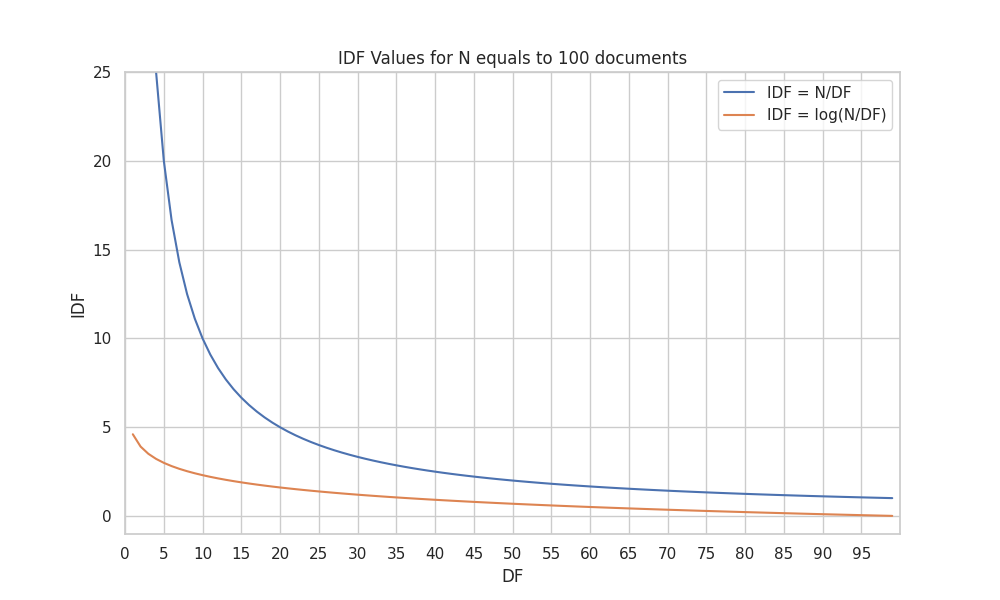
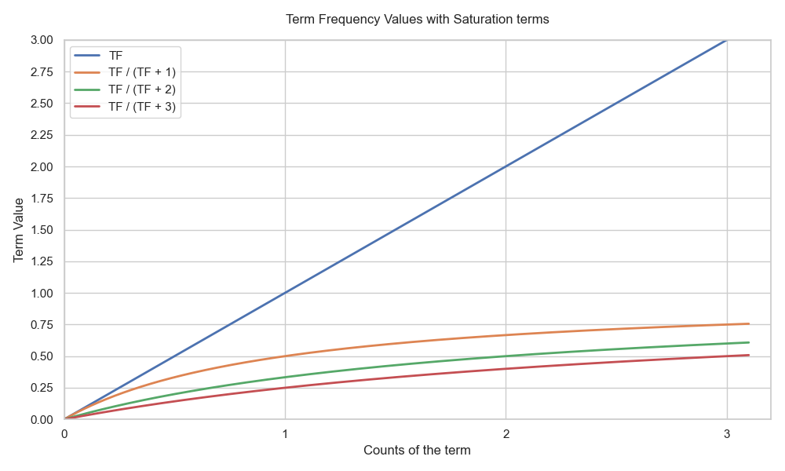

import Highlight from '../../components/Highlight.astro';

This post is a summary of the [Understanding TF-IDF and BM-25](https://kmwllc.com/index.php/2020/03/20/understanding-tf-idf-and-bm-25/) article by [KMW Technology](https://kmwllc.com/).
Here we going straight to the point, to use this post as a quick reminder of how these algorithms work.

These algorithms are used <Highlight color="yellow">to rank documents based on a query</Highlight>.
They are used in search engines, recommendation systems, etc.
Mainly they <Highlight color="green">reward the relevance</Highlight> of a query 
with respect to a document. When applied to all documents,
we can known which documents are more relevant to a query.

## TF-IDF

### Assumptions

The TF-IDF algorithm is based on two concepts:
- **Term Frequency (TF)**: The number of times a term appears in a document. It is supposed
that the more times a document contains a term, the more likely it is to be about that term.
Can be seen as a proxy for the <Highlight color="purple">*relevance*</Highlight> of a term in a document.
- **Inverse Document Frequency (IDF)**: The number of documents that contain a term
by the total number of documents, scaled logarithmically. All terms are not equally important,
imagine filler words like "the", "a", "an", etc.
We need to judge the <Highlight color="purple">*rarity*</Highlight> of the terms. To do so
we account for the number of documents that contain a term from the total number of documents. But 
there is a problem: imagine that we have 100 documents and a term like "elephant" appears in 1 document
while the term "giraffe" occurs in 2 documents, if we simply divide the number of documents that contain
a term by the total number of documents, we will get that "elephant" is the double (100 points) as important
as "giraffe" (50 points). But we know that they are pretty similarly rare. To solve this problem we use
the <Highlight color="yellow">logarithm of the fraction</Highlight>. Check the following graph to see how the logarithm of the fraction
scales the values.

### Formula

The TF-IDF formula is the following:

$$\text{TF-IDF}(t, d) = \text{TF}(t, d) \times \text{IDF}(t)$$

Where $t$ is a term and $d$ is a document. We can expand the formula as follows:

$$\text{TF-IDF}(t, d) = \text{counts of t in d} \times \log{\frac{\text{total number of documents}}{\text{number of documents containing t}}}$$

### Example

Let's walk through an example of vectorizing a small corpus consisting of two documents:

- **D1**: "I love machine learning"
- **D2**: "I love deep learning"

**1. Vocabulary**

First, we identify the unique terms in the corpus to build our vocabulary. We usually sort them alphabetically:

`["deep", "I", "learning", "love", "machine"]`

**2. Term Frequency (TF)**

Next, we calculate the Term Frequency (TF) for each term in each document. In this simple version, we just use the raw count.

| Term     | D1 ("I love machine learning") | D2 ("I love deep learning") |
| :------- | :----------------------------: | :-------------------------: |
| deep     |               0                |              1              |
| I        |               1                |              1              |
| learning |               1                |              1              |
| love     |               1                |              1              |
| machine  |               1                |              0              |

**3. Inverse Document Frequency (IDF)**

Now we calculate the IDF for each term using the formula $\text{IDF}(t) = \log(\frac{N}{DF(t)})$, where $N=2$ (total number of documents). We will use base 10 for the logarithm.

| Term     | DF (Doc Frequency) |      IDF Calculation       | IDF Value |
| :------- | :----------------: | :------------------------: | :-------: |
| deep     |         1          | $\log_{10}(\frac{2}{1})$ |   0.301   |
| I        |         2          | $\log_{10}(\frac{2}{2})$ |     0     |
| learning |         2          | $\log_{10}(\frac{2}{2})$ |     0     |
| love     |         2          | $\log_{10}(\frac{2}{2})$ |     0     |
| machine  |         1          | $\log_{10}(\frac{2}{1})$ |   0.301   |

**4. TF-IDF Vectors**

Finally, we compute the TF-IDF score for each term in each document by multiplying TF by IDF.

**For Document 1:**

| Term     | TF |  IDF  | TF-IDF |
| :------- | :-: | :---: | :----: |
| deep     | 0  | 0.301 | **0**  |
| I        | 1  |   0   | **0**  |
| learning | 1  |   0   | **0**  |
| love     | 1  |   0   | **0**  |
| machine  | 1  | 0.301 | **0.301** |

**For Document 2:**

| Term     | TF |  IDF  | TF-IDF |
| :------- | :-: | :---: | :----: |
| deep     | 1  | 0.301 | **0.301** |
| I        | 1  |   0   | **0**  |
| learning | 1  |   0   | **0**  |
| love     | 1  |   0   | **0**  |
| machine  | 0  | 0.301 | **0**  |

The final TF-IDF vectors corresponding to the vocabulary `["deep", "I", "learning", "love", "machine"]` are:

- **D1**: `[0, 0, 0, 0, 0.301]`
- **D2**: `[0.301, 0, 0, 0, 0]`

Notice how common words like "I", "love", and "learning" have a score of $0$ because they appear in all documents and provide no discriminative power in this small corpus. The unique words "machine" and "deep" receive higher scores, identifying the specific topic of each document.

### Problems

- **Term Frequency**: The TF is not normalized by the length of the document.
Longer documents are given an unfair advantage over shorter ones
because they have more space to include more occurrences of a term,
even though they might not be more relevant to the term. 

## BM25

The BM25 algorithm is based on the TF-IDF algorithm, but trying to solve some of its problems.

### Assumptions

- **Saturation**: The relevance of a term in a document saturates after a certain point. Is it
really *twice* as relevant a document with 200 occurrences of a term than a document with 100 occurrence?
We need that the term frequency contribution increases fast when the term frequency is small and 
then increases more slowly. To achive this we will use a small trick: modify the term frequency
with $$\frac{TF}{TF+k}$$, where <Highlight color="green">$k$ is a hyperparameter</Highlight>.
This way the term frequency contribution
will always saturate to 1 for large values of $TF$, while for small values of $TF$ it will increase
moderately fast. Additionaly, a side-effect of this saturation is that we end up rewarding
<Highlight color="yellow">complete matches over partial ones</Highlight>. For example, given a query searching for
"cat and dog" and $k=1$, a document with both ocurrences of "cat" and "dog" will be more relevant
than a document with only two ocurrences of "cat" or "dog", as the values will not be so predominant.

- **Document Length**: If a document is very short and contains an occurrence of a term, like "cat",
that's a very strong signal that the document is about cats. But if a document is very long and only contains
one occurrence of a "cat", probably the document is not about cats. To solve this problem we need to reward
the matches in short documents more than the matches in long documents. The first step we need to do 
is to decide what is a short and a long document.
To do so we will use the average document length of the corpus. Going back to our saturation formula,
$$\frac{TF}{TF+k}$$, we can adjust the $k$ hyperparameter to account for the document length.
If we multiply $$k$$ by the ratio between the document length and the average document length
($$\frac{doc\_length}{avg\_doc\_length}$$), we will
get a value that will be smaller than 1 for short documents and larger than 1 for long documents. This
way we will <Highlight color="yellow">reward the matches in short documents more than the matches in long documents</Highlight>,
as lower values of $k$ will be used for short documents than for long documents. Building on top of this,
maybe for our problem is not so important the document length, so to control the importance of the document
length we will use a <Highlight color="green">hyperparameter $$b$$</Highlight>, between 0 and 1,
that will be multiplied by the ratio between the document length and the average document length.
This hyperparameter is introduced as $$1-b+b\frac{doc\_length}{avg\_doc\_length}$$, being
multiplied by $k$ in the saturation formula. When $$b=0$$ we will not take into account the document length,
and when $$b=1$$ we will fully take into account the document length.

### Formula

Although some modifications were proposed for the IDF part of the formula, the most 
important changes were described in the assumptions section. The BM25 formula, then, is the following:

$$\text{BM25}(t, d) = \frac{\text{TF}(t, d) \times (k_1 + 1)}{\text{TF}(t, d) + k_1 \times (1 - b + b \times \frac{\text{doc\_length}}{\text{avg\_doc\_length}})} \times \log{\frac{\text{total number of documents}}{\text{number of documents containing t}}}$$

### Problems

- Semantic understanding: The BM25 algorithm does not take into account the semantic understanding
of the terms. Cannot distinguish between "cat" and "cats", for example. To solve this problem
we need to use more complex algorithms, like word embeddings, that can capture the semantic
meaning of the terms.

## Credits

- [Understanding TF-IDF and BM-25](https://kmwllc.com/index.php/2020/03/20/understanding-tf-idf-and-bm-25/)
- [Breaking Down the TF-IDF Formula](https://melaniewalsh.github.io/Intro-Cultural-Analytics/05-Text-Analysis/03-TF-IDF-Scikit-Learn.html#breaking-down-the-tf-idf-formula)
- [TF-IDF Implementation by Scikit-Learn](https://scikit-learn.org/stable/modules/generated/sklearn.feature_extraction.text.TfidfVectorizer.html)
- <a href="/notebooks/tfidf-graphs.ipynb" download="tfidf-graphs.ipynb">TF-IDF Graphs Notebook</a>