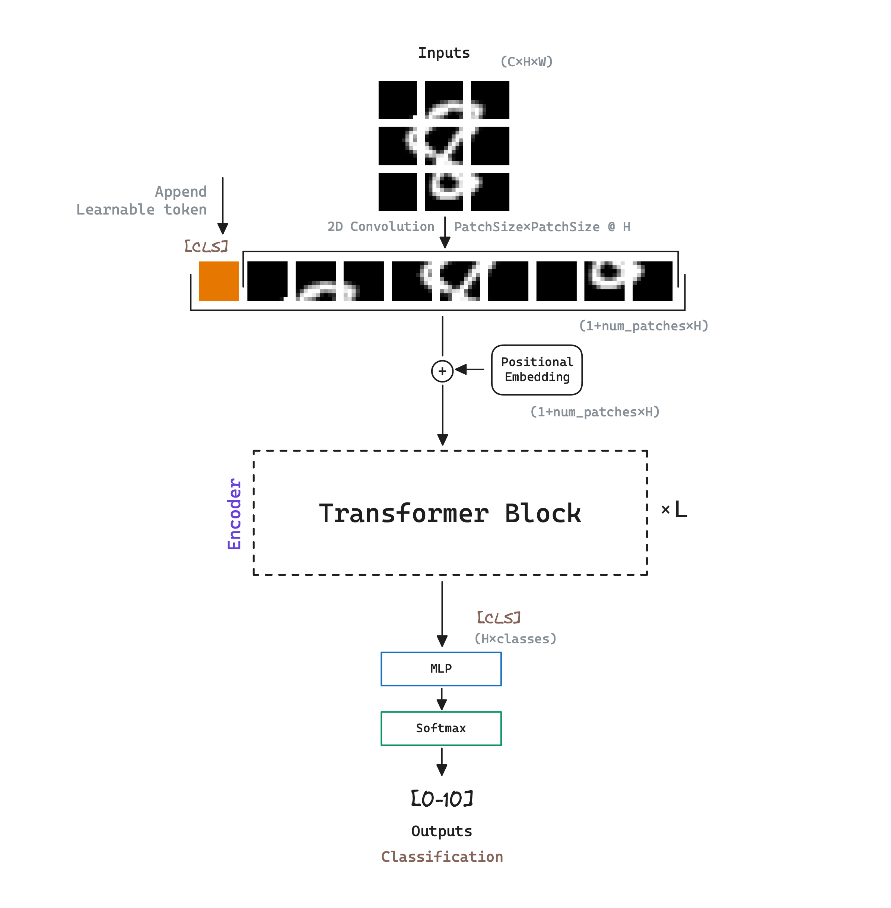

import Highlight from '../../components/Highlight.astro';

## Abstract
  
Self-attention-based architectures, in particular [[Transformer - Attention Is All You Need|Transformers]], have become the model of choice in natural language processing (NLP). The predominant approach is to pre-train on a large text corpus and then fine-tune on a smaller task-specific dataset.

ViT experiments with applying a standard Transformer directly to images, with the fewest possible modifications. To do so, <Highlight color="green">ViT splits an image into patches</Highlight> and provide the sequence of linear embeddings of these patches as an input to a Transformer. Image patches are treated the same way as tokens (words) in NLP applications. ViT model is trained on image classification in <Highlight color="green">supervised fashion</Highlight>.  

When trained on mid-sized datasets ViT yields modest accuracies: Transformers lack some of the inductive biases inherent to CNNs, such as translation equivariance and locality, and therefore do not generalize well when trained on insufficient amounts of data. However, the picture changes if <Highlight color="yellow">ViT is trained on larger datasets</Highlight>, trumping inductive biases, achieving excellent results.

## Architecture

ViT's model architecture is a multi-layer <Highlight color="brown">bidirectional Transformer Encoder</Highlight>, inspired in [[BERT - Bidirectional Encoder Representations from Transformers|BERT]] and following the original [[Transformer - Attention Is All You Need|Transformer]] design as closely as possible.




ViT denotes the number of the Transformer encoder blocks as $L$, the hidden size as $H$,
and the number of self-attention heads as $A$. ViT initial model designs are the following:

| Model Name  | $L$ (Transformer blocks) | $H$ (Hidden size) | $A$ (Self-Attention heads) |
|-------------|--------------------------|-------------------|---------------------------|
| ViT-Base    | 12                       | 768               | 12                        |
| ViT-Large   | 24                       | 1024              | 16                        |
| ViT-Huge    | 32                       | 1280              | 16                        |
  
### The Input: Patch Embedding 

The standard Transformer receives as input a 1D sequence of token embeddings. Naive application of self-attention to images would require that each pixel attends to every other pixel. With quadratic cost in the number of pixels, this does not scale to realistic input sizes.

To handle 2D images, we reshape each image into a sequence of <Highlight color="green">flattened 2D patches of an arbitrary size</Highlight>. The resulting number of patches serves as the effective input sequence length for the Transformer. The Transformer uses constant latent vector size $H$ through all of its layers, so the patches are mapped to $H$ dimensions with a trainable linear projection. ViT refers to the output of this projection as the patch embeddings.

<Highlight color="yellow">A simple way to perform patch division and prediction is through 2D convolution</Highlight>. The kernel will be of the desired patch size, introducing a stride of the patch size as well, so that there is no overlap between the pixels. On the other hand, <Highlight color="yellow">to achieve H dimensions</Highlight>, we will just need to set $H$ (also known as *n_embd*) as the <Highlight color="yellow">desired output channels</Highlight> of the 2D convolution operation.

```python
class PatchEmbedding(nn.Module):
	def __init__(self, config):
		super().__init__()
		self.projection = nn.Conv2d(
			in_channels=config.in_channels, out_channels=config.n_embd,
			kernel_size=config.patch_size, stride=config.patch_size
		)
		self.n_patches = (config.img_size // config.patch_size) ** 2
 
	def forward(self, x): # (batch, in_channels, height, width)
		x = self.projection(x) # (batch, n_embd, patches, patches)
		x = x.flatten(2) # (batch, n_embd, n_patches) - "stacking" all patches
		x = x.transpose(1, 2) # (batch, n_patches, n_embd)
		return x
```

#### Adapt to Higher Resolutions

<Highlight color="cyan">It is often beneficial to fine-tune at higher resolution than pre-training</Highlight>. When feeding images of higher resolution, authors <Highlight color="green">keep the patch size the same</Highlight>, <Highlight color="yellow">which results in a larger effective sequence length</Highlight>.

ViT can handle arbitrary sequence lengths (up to memory constraints), however, the pre-trained positional embeddings may no longer be meaningful. We therefore perform <Highlight color="yellow">2D interpolation of the pre-trained positional embeddings</Highlight>, according to their location in the original image. Note that this resolution adjustment and patch extraction are the only points at which an inductive bias about the 2D structure of the images is manually injected into the model. 

```python
# example: 224:(14x14+1) -> 384: (24x24+1) (patch size 16x16)
def resize_pos_embed(posemb: torch.Tensor, ntok_new: int) -> torch.Tensor:
	""" Resizes positional embeddings to new number of tokens.

	Args:
		- posemb (torch.Tensor): Positional embeddings 
			(batch_size, seq_length, n_embd)
		- ntok_new (int): New number of tokens/seq_length.

	Returns:
		- torch.Tensor: Resized positional embeddings
			(batch_size, ntok_new, n_embd)
	"""
	# Rescale the grid of position embeddings when loading - 24x24+1
	# posemb_clas is for cls token, posemb_grid for the following tokens
	posemb_clas, posemb_grid = posemb[:, :1], posemb[0, 1:]
	ntok_new -= 1 

	gsize_old = int(math.sqrt(len(posemb_grid))) # 14
	gsize_new = int(math.sqrt(ntok_new)) # 24  

	# [1, 196, n_embd] -> [1, 14, 14, n_embd] -> [1, n_embd, 14, 14]
	posemb_grid = posemb_grid.reshape(
		1, gsize_old, gsize_old, -1
	).permute(0, 3, 1, 2)

	# [1, n_embd, 14, 14] -> [1, n_embd, 24, 24]
	posemb_grid = F.interpolate(
		posemb_grid, size=(gsize_new, gsize_new), mode='bicubic'
	)
	
	# [1, n_embd, 24, 24] -> [1, 24×24, n_embd]
	posemb_grid = posemb_grid.permute(0, 2, 3, 1).reshape(
		1, gsize_new * gsize_new, -1
	)

	# [1, 24×24+1, n_embd]
	posemb = torch.cat([posemb_cls, posemb_grid], dim=1)

	return posemb
```

### Training

Similar to [[BERT - Bidirectional Encoder Representations from Transformers|BERT's]] <Highlight color="green">[class] token</Highlight>, ViT prepends a learnable embedding to the sequence of embedded patches, whose state at the output of the Transformer encoder serves as the <Highlight color="yellow">image representation</Highlight>. Both during pre-training and fine-tuning, a classification head is attached to the image representation `[class]` output. The classification head is implemented by a MLP with one hidden layer at pre-training time and by a single layer at fine-tuning time.

<Highlight color="yellow">Position embeddings</Highlight> are added to the patch embeddings to retain positional information. Standard learnable 1D position embeddings are used.  

The authors note that ViT only performs well when <Highlight color="cyan">trained on huge datasets</Highlight> with millions of images. Specifically, [[ResNet - Deep Residual Learning for Image Recognition]] perform better with smaller pre-training datasets but plateau sooner than ViT, which performs better with larger pre-training. This result reinforces the intuition that the convolutional inductive-bias is useful for smaller datasets, but for larger ones, learning the relevant patterns directly from data is sufficient, even beneficial.

### Inductive Bias

ViT has much less image-specific inductive bias than Convolutional Neural Networks (CNNs). In CNNs, locality, two-dimensional neighborhood structure, and translation equivariance are baked into each layer throughout the whole model. In ViT, only MLP layers are local and translationally equivariant, while the self-attention layers are global. 

The position embeddings at initialization time carry <Highlight color="yellow">no information about the 2D positions</Highlight> 
of the patches and all spatial relations between the patches have to be learned from scratch.

## References

- [Paper - An Image is Worth 16x16 Words: Transformers for Image Recognition at Scale](https://arxiv.org/abs/2010.11929)
- [ViT Pytorch Implementation](https://github.com/AIdventures/microViT)
- Personal full ViT implementation and training code at <a href="https://github.com/AIdventures/microViT" target="_blank">microViT</a>.  
- <a href="/diagrams/vit.excalidraw" download="vit.excalidraw">ViT Excalidraw diagram source</a>
